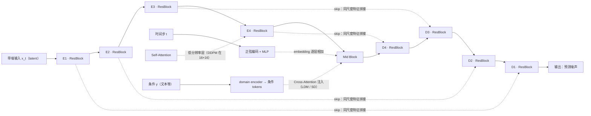
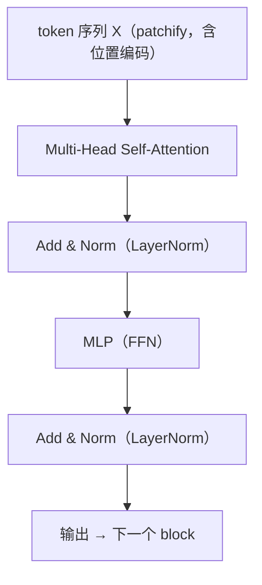
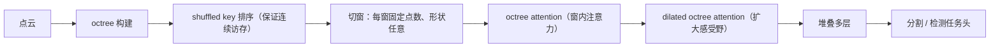
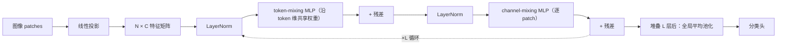

## UNet

U-Net 出自医学图像分割（Ronneberger et al. 2015）：编码器逐级下采样，解码器对称上采样，用 skip connection 把编码器各尺度的特征直接传给解码器，兼顾语义与细节。生成模型把它用作条件去噪网络：

- [[DDPM]] 的 U-Net 以带噪图像为输入预测噪声 $\epsilon_\theta(x_t,t)$，时间步由正弦编码 + MLP 算成 embedding 后逐层相加注入；卷积感受野有限，故在 16×16 的低分辨率特征上加了 self-attention。
- [[LDM]] 沿用同一骨架，但把条件从时间步推广到任意模态：文本等条件先经 domain encoder 编码成 token，再通过 cross-attention 注入；同时网络从像素空间搬到压缩后的 latent 空间（SD 采用 8× 下采样）上工作，计算量大幅下降。SD 1.x/2.x 就是这套方案的规模化（见 [[Pretrained Model]]）。
- 在 [[ControlNet]] 这类可控生成工作中，冻结 U-Net 的各分辨率层级被当作注入空间条件的位置，通过可训练副本的 zero-conv 残差附加信息。

*图：条件 U-Net 去噪骨干示意（层级数目与注意力位置因模型而异，时间步注入与 cross-attention 注入仅示意）。*

<!-- 论文原图占位：本节建议替换为 LDM 论文（Rombach et al. 2022, arXiv:2112.10752）中的条件生成架构总览图——
     VAE 把图像压到 latent → 在 latent 上做条件扩散（UNet + cross-attention 注入 τ_θ(y)）→ VAE 解码器。
     （注意：DDPM 论文本身没有专门的网络结构图。）
     下载到 content/assets/ldm-architecture.png 后，把下面这行取消注释即可：
      -->

简言之，U-Net 的"多尺度 + 跳连"结构与 diffusion 逐级去噪的过程契合，是 [[DiT]] 之前图像生成模型的事实标准骨干。

## vanilla Transformer block

指 transformer 的基本 block（Vaswani et al. 2017）：token 序列先做 multi-head self-attention，再过逐 position 的 MLP，每步带残差连接与 LayerNorm（post-norm）；attention 定义为

$$
\mathrm{softmax}\left(\frac{QK^T}{\sqrt d}\right)V
$$

本身置换等变，位置信息要靠加在输入上的位置编码提供。图像要进入这种结构需先 patchify——把 patch 摊平成 token（ViT 的做法，[[DiT]] 对 latent 同样处理）。

作为生成骨干，真正需要设计的是**条件如何注入**：

- UNet 里的 block 只做图像内部的 self-attention，时间步走逐层相加的 embedding，文本走 cross-attention（[[LDM]]）；
- [[DiT]] 把时间步/类别算成 modulation，用 adaLN-Zero 以 scale/shift/gate 调制每个 block；论文比较了 cross-attention、in-context 等注入方式，adaLN-Zero 简单且一致最优；
- 文本到图像的主流方案再进一步：把文本 token 拼进序列做 joint attention，两种模态各用一套权重（SD3/FLUX 的 MMDiT，见 [[Pretrained Model]]）。

*图：vanilla block（post-norm）的数据流；[[DiT]] 的 adaLN-Zero 则是把 LayerNorm 换成条件调制，见正文。*

<!-- 论文原图占位：vanilla Transformer block 的原图见 Vaswani et al. 2017（arXiv:1706.03762）——
     Figure 1 的 encoder 部分（含 Add & Norm 的子层结构）或 Figure 2 的 Multi-Head / Scaled Dot-Product Attention；
     如需配 DiT 的条件注入变体，可另取 DiT 论文（arXiv:2212.09748）中 DiT block 与 adaLN-Zero 的示意图。
     下载到 content/assets/transformer-block.png（可选 dit-blocks.png）后，取消注释：
      -->

## OctFormer

OctFormer（Peng-Shuai Wang, SIGGRAPH 2023）是面向 3D 点云的 transformer 骨干，用于分割、检测等任务。它要解决的问题有两层：全局 attention 在点数上是二次复杂度；而把点云切窗后，每个窗口内的点数严重不均，GPU 难以高效并行。作者观察到 attention 对局部窗口的**形状**不敏感，于是利用 octree 的 shuffled key 把空间排序，切出"点数固定、几何形状任意"的窗口做注意力（octree attention），再辅以 dilated octree attention 扩大感受野。这一注意力实现只有约 10 行代码，复杂度随点数线性增长，20 万点以上时比既有点云 attention 快约 17 倍。在 ScanNet200 等基准上，OctFormer 超过了 sparse-voxel CNN 与先前的点云 transformer（ScanNet200 mIoU 高出 7.3）。

*图：OctFormer 的处理流程（引自论文描述）。*

<!-- 论文原图占位：OctFormer 论文（arXiv:2305.03045, SIGGRAPH 2023）的架构主图——octree attention 的
     固定点数窗口切分与 dilated octree attention 示意；作者主页 wang-ps.github.io/octformer 有页面与图。
     下载到 content/assets/octformer.png 后，取消注释：
      -->

## MLP-mixer

MLP-mixer（Tolstikhin et al., ICLR 2022）验证了"token mixing 不一定要 attention"：patch 化后得到 $N\times C$ 的特征矩阵，交替用两个 MLP 沿两条轴混合信息——channel-mixing 逐 patch 变换特征，token-mixing 沿 token 维做共享权重的全连接，实现跨整张图的全局信息交换；外层再接残差与 LayerNorm，最后全局平均池化接分类头。整体没有卷积与注意力，计算量与 token 数成线性关系，同等算力下在中型数据集上与 ViT 结果相当，代价是几乎不带空间归纳偏置，需要更多数据或正则来补。它是"attention 是否必要"讨论中的代表架构（后续 MetaFormer 等沿用同一问题），也是理解 token mixing 设计空间的常用入口。

*图：MLP-mixer 的 mixer 层示意；两轴混合的顺序与归一化位置在不同实现中略有出入，不影响本质。*

<!-- 论文原图占位：MLP-mixer 论文（Tolstikhin et al. 2021, arXiv:2105.01601）的模型总览图——
     patch 化 → per-patch 线性投影 → 交替 token-mixing / channel-mixing 的 mixer 层。
     下载到 content/assets/mlp-mixer.png 后，取消注释：
      -->
