## Overview

上采样增加特征图的空间分辨率，下采样减小空间分辨率。具体可以通过插值、卷积、池化或空间与通道之间的重排完成，它们对数值的处理方式不同。

下面省略 batch 维，使用 $H\times W\times C$ 表示特征形状，$r$ 表示采样倍率。图中的数字用于演示计算，字母表示特征值。

| 方法 | 空间变化 | 是否有可学习参数 | 如何处理特征 |
| --- | --- | --- | --- |
| 最近邻插值 | 放大或缩小 | 否 | 取最近位置的值 |
| 双线性 / 双三次插值 | 放大或缩小 | 否 | 对邻域中的值加权求和 |
| 插值 + 卷积 | 通常放大 | 卷积有 | 先调整尺寸，再学习特征变换 |
| 转置卷积 | 通常放大 | 有 | 将每个输入的贡献铺到输出，再相加 |
| PixelShuffle | 放大 | 否 | 通道 → 空间 |
| 步幅卷积 | 缩小 | 有 | 按步幅计算局部加权和 |
| 最大 / 平均池化 | 通常缩小 | 否 | 取局部最大值或平均值 |
| 滤波后降采样 | 缩小 | 固定滤波时无 | 先去掉部分高频，再减少采样点 |
| PixelUnshuffle | 缩小 | 否 | 空间 → 通道 |

## Upsampling

### Nearest Neighbor

最近邻插值直接取距离输出采样位置最近的输入值。放大 2 倍时，可以理解为将一个像素复制成一个 $2\times2$ 区域：

$$
H\times W\times C\rightarrow2H\times2W\times C
$$

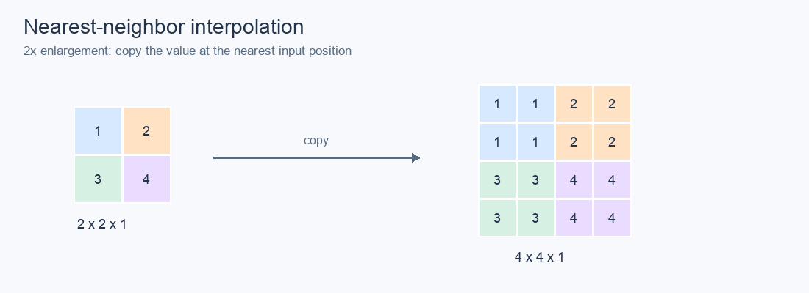

计算简单，不会产生新的数值，但放大后容易出现块状边缘。

### Bilinear

双线性插值使用周围 4 个位置的值，先沿一个方向线性插值，再沿另一个方向插值。设采样点在四个位置之间的相对坐标为 $(u,v)$：

$$
y=(1-u)(1-v)x_{00}+u(1-v)x_{01}+(1-u)vx_{10}+uvx_{11}
$$

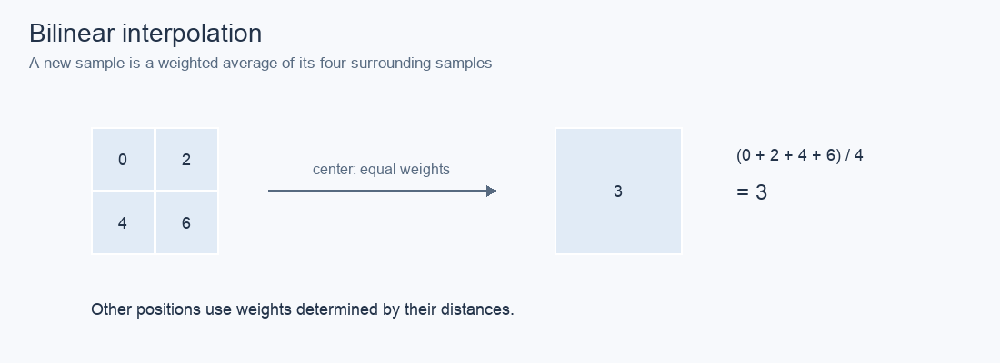

越接近某个位置，该位置的权重越大。结果通常比最近邻平滑，但也可能模糊边缘。实际权重取决于输入和输出采样点如何对齐，图中只演示中心点。

### Bicubic

双三次插值将邻域扩大到 $4\times4$，使用三次插值核计算 16 个位置的权重：

$$
y=\sum_{i=0}^{3}\sum_{j=0}^{3}w_{ij}x_{ij}
$$

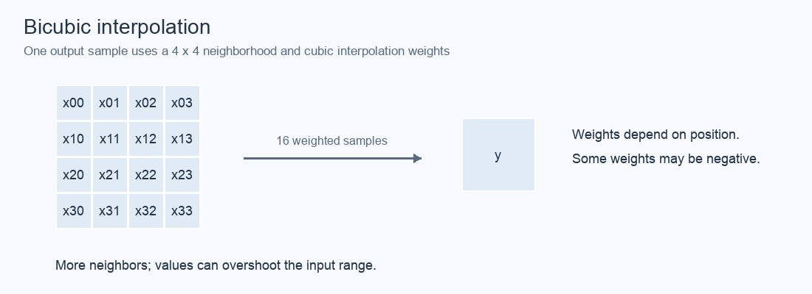

相比双线性，它使用更多邻域信息，通常能保留更清晰的边缘，但计算量更大。部分权重可能为负，因此输出可能超出输入值的范围，在边缘附近出现过冲。

### Resize Conv

先用最近邻或双线性插值放大特征，再使用普通卷积融合邻域信息：

$$
Y=\operatorname{Conv}(\operatorname{Resize}(X))
$$

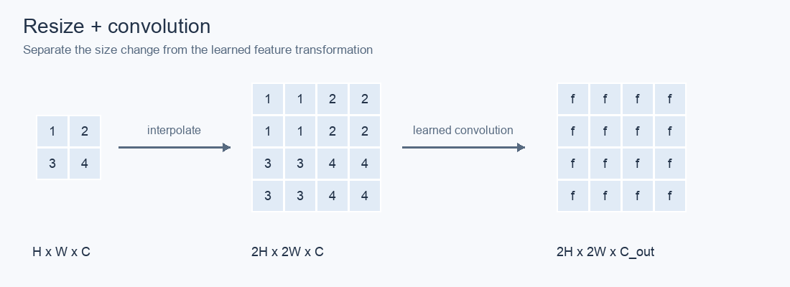

插值负责改变尺寸，卷积负责学习特征。图中卷积采用 stride 为 1、保持尺寸的 padding，因此输出宽高由插值决定。这种方式比较直观，但卷积需要在放大后的特征图上计算。

### Transposed Convolution

转置卷积让每个输入值乘以一组可学习的卷积核权重，再将结果铺到输出的对应区域。相邻输入铺出的区域如果重叠，就将贡献相加。

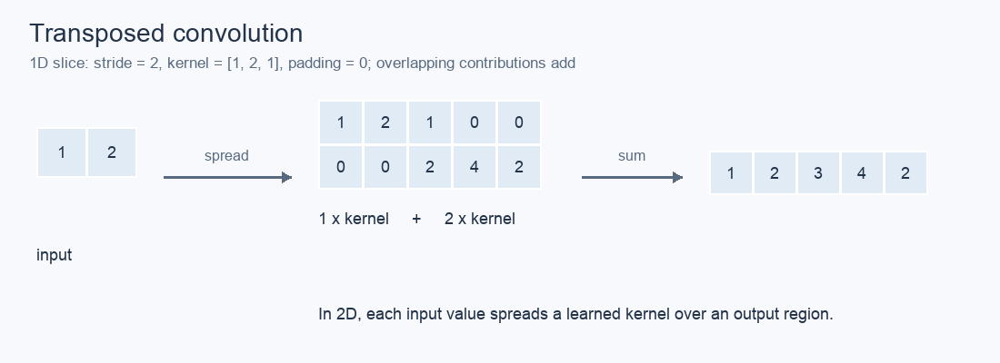

图中用一维情况演示：输入为 $[1,2]$，卷积核为 $[1,2,1]$，stride 为 2。第一个输入贡献 $[1,2,1,0,0]$，第二个贡献 $[0,0,2,4,2]$，相加得到 $[1,2,3,4,2]$。二维情况则将贡献铺到二维区域。

若普通卷积写成 $y=Ax$，对应的转置卷积使用的是 $A^\top$ 的连接方式，因此叫“转置卷积”。它不是 $A^{-1}$，通常不能还原卷积前的输入；有时称为 deconvolution，但不代表真正求逆。

高度方向的输出尺寸为：

$$
H_{out}=(H_{in}-1)s-2p+d(k-1)+o+1
$$

其中 $s$ 为 stride，$p$ 为 padding，$d$ 为 dilation，$k$ 为卷积核大小，$o$ 为 output padding，宽度同理。output padding 用于确定输出尺寸，不是在结果周围直接补零。放大倍率取决于这些参数，并非由卷积核大小单独决定。

### PixelShuffle

PixelShuffle 将通道中的值按固定规则搬到空间位置，使宽高增加、通道数减少：

$$
H\times W\times(r^2C)
\xrightarrow{\mathrm{PixelShuffle}(r)}
rH\times rW\times C
$$

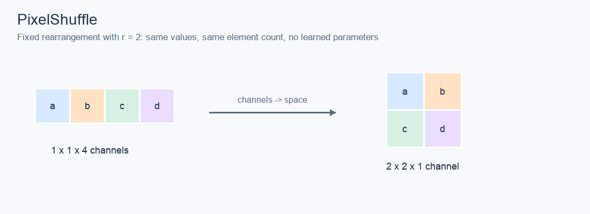

当 $r=2$ 时，每组 4 个通道分别放到输出区域的左上、右上、左下和右下。输入通道数需要能被 $r^2$ 整除。它没有可学习参数，不做插值，也不是随机打乱；数值和元素总数都不变。

[[SwinIR]] 的经典超分辨率重建头先通过卷积生成所需通道，再用 PixelShuffle 上采样：

$$
H\times W\times C
\xrightarrow{\mathrm{Conv}}H\times W\times4C
\xrightarrow{\mathrm{PixelShuffle}(2)}2H\times2W\times C
$$

卷积学习每个输出位置需要的特征，PixelShuffle 将这些特征放到对应位置，之后再输出图像。这种卷积与重排的组合通常称为子像素卷积。主干的大部分计算可以留在低分辨率空间。

## Downsampling

### Strided Convolution

普通卷积在每个位置计算邻域加权和，步幅卷积将窗口每次移动的距离设为 $s>1$，从而减少输出位置：

$$
Y_{i,j}=\sum_{a,b}K_{a,b}X_{si+a,sj+b}
$$

这里用单通道、无 padding、无 bias 的情况表示，多通道时还需要沿输入通道求和。

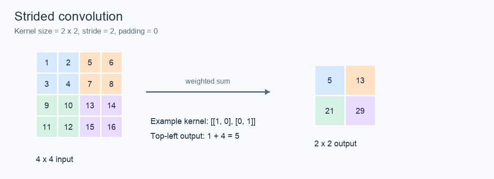

图中使用 $2\times2$ 卷积核和 stride 2，将 $4\times4$ 输入变成 $2\times2$ 输出。卷积核只是演示数值，训练时权重可以学习。输出通道数由卷积核数量决定，因此可以同时降低分辨率、增加通道数。

一般情况下，高度为：

$$
H_{out}=\left\lfloor\frac{H_{in}+2p-d(k-1)-1}{s}\right\rfloor+1
$$

其中 $p,d,k$ 分别表示 padding、dilation 和卷积核大小。步幅卷积通常会丢失信息，后接转置卷积也不保证恢复原输入。

### Max Pooling

最大池化从每个窗口中取最大值，通常保持通道数不变：

$$
Y_{i,j,c}=\max_{(a,b)\in\mathcal W_{i,j}}X_{a,b,c}
$$

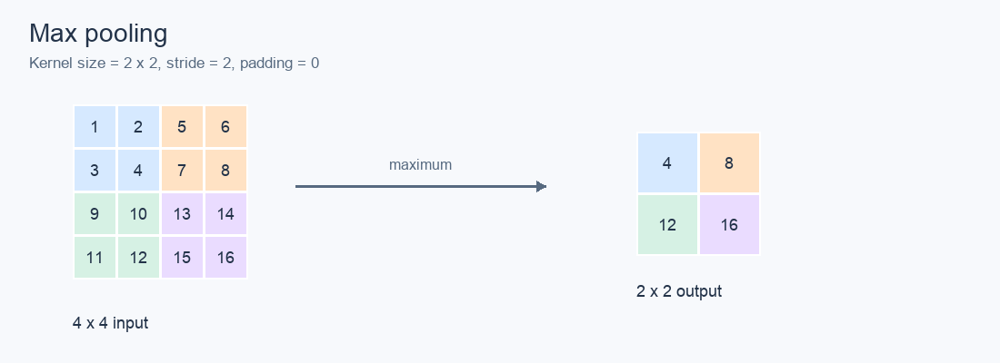

它保留局部最强的响应，其他值被丢弃。图中窗口大小和 stride 都为 2，所以宽高各减半。是否下采样由 stride 等参数决定，不是所有池化都会缩小分辨率。

### Average Pooling

平均池化对窗口中的值求平均：

$$
Y_{i,j,c}=\frac{1}{|\mathcal W_{i,j}|}\sum_{(a,b)\in\mathcal W_{i,j}}X_{a,b,c}
$$

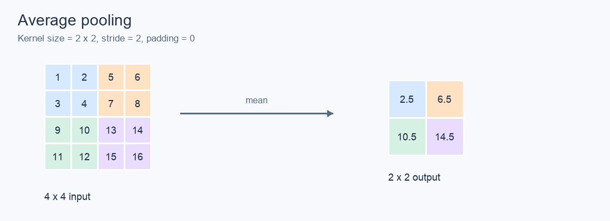

它保留局部整体强度，对局部变化做平滑，但会丢失细节。图中左上区域的输出为 $(1+2+3+4)/4=2.5$。最大池化和平均池化都没有可学习参数。

### Filter and Downsample

缩小图像时，直接隔点取样容易将高频变化变成错误的低频模式，也就是混叠。可以先通过低通滤波平滑高频，再减少采样点：

$$
Y=\downarrow_r\bigl(h*X\bigr)
$$

其中 $h$ 为低通滤波核，$\downarrow_r$ 表示每隔 $r$ 个位置取样。

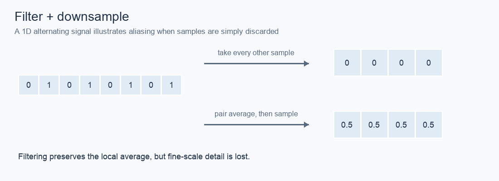

图中直接取偶数索引位置得到全 0，丢掉了信号的平均强度；先对相邻两点平均再降采样，则得到 0.5。低通滤波减少混叠，但仍会舍弃高频细节。

双线性和双三次插值也可用于缩小图像，不过“使用插值”不等于“已经做了充分的抗混叠”。实际缩小时要注意实现是否启用抗混叠滤波；面积采样则按输出像素覆盖的输入区域做平均，整数倍率、边界对齐时可对应非重叠平均池化。

### PixelUnshuffle

PixelUnshuffle 将每个 $r\times r$ 区域中的值收进通道，是 PixelShuffle 的逆操作：

$$
H\times W\times C
\xrightarrow{\mathrm{PixelUnshuffle}(r)}
\frac{H}{r}\times\frac{W}{r}\times(r^2C)
$$

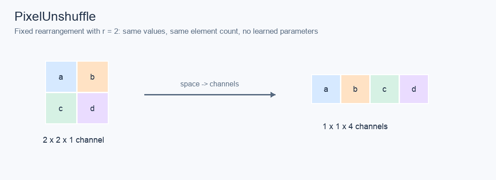

输入宽高需要能被 $r$ 整除。它不取平均，也不丢弃像素，只把空间信息搬到通道中，因此空间尺寸缩小并不意味着信息量减少。如果中间没有其他处理，用相同倍率的 PixelShuffle 可以恢复原输入：

$$
\operatorname{PixelShuffle}_r(\operatorname{PixelUnshuffle}_r(X))=X
$$

[[DiffIR]] 在 CPEN 前使用 PixelUnshuffle 将局部像素收进通道，后续网络再提取紧凑先验。[[SwinIR]] 的经典超分辨率重建流程只使用 PixelShuffle，不需要配对使用 PixelUnshuffle；token 展平和窗口划分也不等同于 PixelUnshuffle。

## References

- [PyTorch：插值及抗混叠选项](https://docs.pytorch.org/docs/2.14/generated/torch.nn.functional.interpolate.html)
- [PyTorch：转置卷积及输出尺寸](https://docs.pytorch.org/docs/2.12/generated/torch.nn.ConvTranspose2d.html)
- [PyTorch：步幅卷积](https://docs.pytorch.org/docs/main/generated/torch.nn.Conv2d.html)
- [PyTorch：最大池化](https://docs.pytorch.org/docs/stable/generated/torch.nn.MaxPool2d)、[平均池化](https://docs.pytorch.org/docs/2.14/generated/torch.nn.AvgPool2d.html)
- [PyTorch：PixelShuffle](https://docs.pytorch.org/docs/stable/generated/torch.nn.PixelShuffle.html)、[PixelUnshuffle](https://docs.pytorch.org/docs/stable/generated/torch.nn.PixelUnshuffle.html)

配图为按上述计算规则绘制的示意图。
