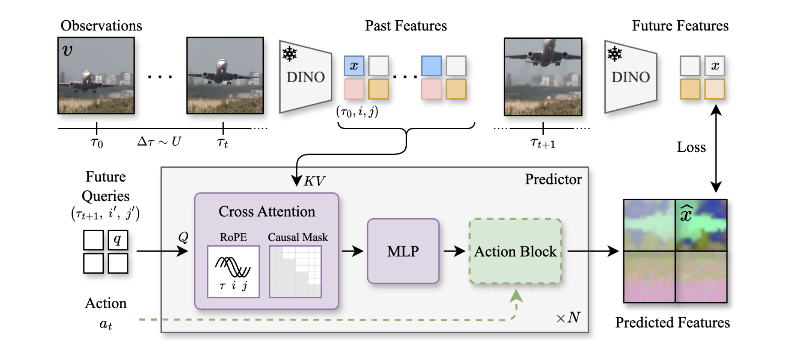

## Overview

相较于 [[JEPA]] 元架构（联合训练 Encoder 与 Predictor），本工作弱化了对 Encoder 的追求，选择直接使用冻结的预训练 DINOv2 作为视觉编码器，转而将重心放在大规模训练 Predictor 上。

架构分为两部分：
- **Frame Encoder**：冻结的 DINOv2 ViT-B/14，将每帧编码为 H×W×768 的 patch token
- **Future Predictor**：N=40 层的 cross-attention transformer（1.1B 参数），在 ~66M 视频上训练，预测未来时刻的 patch token

通过这种设计，避免了联合训练的复杂性，专注于学习时序动力学。预测器在潜在空间而非像素空间工作，绕过了对像素级细节的建模，使模型更高效（<1B 参数 vs. COSMOS 12B）。

训练策略为两阶段：先在大规模无标注视频上预训练无条件模型，再在动作-观察轨迹上微调，实现动作条件世界模型用于规划任务。

与 V-JEPA 对比：V-JEPA 联合训练 Encoder 与 Predictor，其 Predictor 是训练 Encoder 的"辅助头"，获得的特征适合视频摘要但次优于预测/规划任务；DINO-world 解耦视觉表征学习与时序建模，冻结强大的预训练编码器，让 Predictor 专注学习时序动力学，在密集预测任务上显著优于 V-JEPA（VSPW mid-term：47.0 vs. 4.6）。

## Method

### Observations and State Space

**Observations**：视频表示为帧序列与时间戳 $\{(v_t, \tau_t)\}_{t=1}^T$，其中 $v_t \in \mathbb{R}^{H' \times W' \times 3}$，$\tau_t \in \mathbb{R}^+$。与以往工作假设固定帧率不同，本工作显式建模时间以适应可变 FPS 训练与细粒度时序控制。

**State**：DINOv2 将每帧映射为特征张量 $x_t = \text{ENCODER}(v_t) \in \mathbb{R}^{H \times W \times D}$，其中 $D=768$ 为嵌入维度。每个 patch token $x_{t,i,j}$ 表示时间戳 $\tau_t$ 与空间位置 $(i,j)$ 的状态单元。

世界模型定义为映射：
$$
(X_{1:t}, T_{1:t}, (\tau_{t'}, i', j')) \rightarrow x_{t',i',j'} \quad \forall (i', j'), \forall t' > t
$$

### Predictor Architecture

**架构**：预测器为 N 个残差 pre-norm cross-attention block 的堆叠。预测未来坐标 $(\tau_{t'}, i', j')$ 的状态时：
1. 从可学习嵌入初始化查询 token $q \in \mathbb{R}^D$
2. 每层中，查询交叉注意到所有过去的 patch token：
   $$
   q \leftarrow q + \text{CROSS\_ATTENTION}(\text{LN}(q), \{x_{t,i,j} | \tau_t < \tau_{t'}\})
   $$
   $$
   q \leftarrow q + \text{MLP}(\text{LN}(q))
   $$
3. 最后线性投影得到预测 $\hat{x}_{t',i',j'} \in \mathbb{R}^D$

**位置编码**：使用 3-axial RoPE 编码时空坐标：
- 时间坐标 $\tau$：使用绝对时间戳（秒），周期范围 $[10^{-2}, 10^2]$，使模型区分不同帧率并外推到更长视频
- 空间坐标 $(i,j)$：使用 $[-1, +1]^2$ 网格上的相对位置，使变化分辨率不改变 patch 间相对距离
- 每个头的 60 维分为三个 20 维块分别编码三个轴（每块 10 个角周期），剩余 4 维不旋转

**训练目标**：下一帧预测 + teacher forcing。给定 T 帧序列，并行计算所有 $(T-1)HW$ 个预测，用 block-triangular mask 保持因果性（帧 $t+1$ 的查询只能注意到 $\leq t$ 的 token）：
$$
\min_\theta \mathcal{L}(x_{t+1,i',j'}, \text{PREDICTOR}_\theta(X_{1:t}, T_{1:t}, (\tau_{t+1}, i', j'))) \quad \forall i', j', t \in \{1, \ldots, T-1\}
$$
其中 $\mathcal{L}$ 为 smooth L1 loss（$\beta=0.1$）。与 V-JEPA/DINO-Foresight 的 masked reconstruction loss 不同，本方法对所有处理的 token 计算损失，而非仅 mask token。

**Variable FPS**：为避免训练时间间隔 $\Delta\tau = \tau_{t+1} - \tau_t$ 偏向短间隔（限制预测视野），从预定义范围 $[\Delta\tau_{\min}, \Delta\tau_{\max}]$ 均匀采样 $T-1$ 个时间间隔，累积求和后加随机起点得到时间戳，再解码最近帧。确保模型在均匀分布的时间间隔上训练。

### Action-Conditioned Fine-tuning

从预训练的无条件视频世界模型出发，通过简单适配实现动作条件：在每个 block（Eq. 3）之后添加 **action block**，用对应动作 $a_t$ 更新查询：
$$
q \leftarrow q + \text{MLP}(\text{LN}([q, a]))
$$

Action block 初始化为恒等映射（layer scale 参数置零），可仅训练 action block 而冻结视频世界模型，缓解过拟合并允许同一基础模型复用于不同任务。相比在序列中交织 action token（如 DINO-WM），本方法避免混合不同类型 token 带来的批处理/掩码复杂性，无需额外容量，且无需全量微调（不破坏已学习的视频理解）。

## Training

**数据**：~66M 未标注网络视频（5-60 秒，不同帧率），内容多样（烹饪教程、户外场景等）。对比实验还在开源数据集（Cityscapes、Something-Something V2）训练，但小规模窄领域数据性能显著下降。

**优化**：
- AdamW，300k 迭代（batch 1024 clips，T=8，224×224）+ 50k 迭代（448×448）
- 学习率 5k warmup 后恒定 $10^{-4}$，weight decay 0.4
- Predictor 尺寸：Base（86M）、Large（304M）、Giant（1.1B），主实验用 Giant（N=40 blocks，D'=1536，24 heads）

**计算资源**：Giant 模型在 16 个 8×H100 节点上训练 95.6 小时（<1B 参数，而 COSMOS 可达 12B）

## Experiments

与 V-JEPA 对比在 VSPW 密集预测任务上的表现（mIoU，0.5s mid-term forecasting）：
- DINO-world：47.0（Present 52.8 → Mid 47.0，gap 5.8）
- V-JEPA ViT-H：4.6（Present 28.0 → Mid 4.6，gap 23.4）

DINO-world 的预测特征质量显著高于 V-JEPA，验证了冻结强大预训练编码器、专注训练 Predictor 学习时序动力学的范式优于联合训练。
