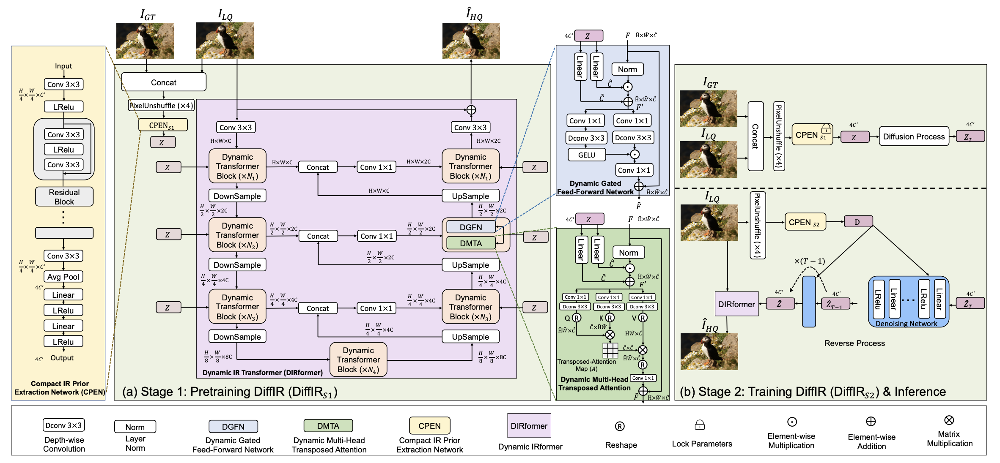

## Overview

DiffIR 主要的设计是使用一个CPEN（卷积神经网络）提取IR Prior，然后使用GT-LQ对训练一个DIRformer用于接受LQ和GT-LQ共同的 IR prior输入重建HQ，
并且使用一个diffusion model，以 LQ 特征为条件，从噪声中估计 GT-LQ 提取的恢复先验。

## CPEN

由卷积残差块和线性层组成，将图像压缩为紧凑向量。第一阶段的 CPENₛ₁ 输入 GT-LQ 对，提取目标先验 $Z$；第二阶段的 CPENₛ₂ 只输入 LQ，提取条件向量 $D$。

$$
Z=\operatorname{CPEN}_{S1}(\operatorname{PixelUnshuffle}(\operatorname{Concat}(I_{GT},I_{LQ})))
$$

## DIRFormer

修改自 Restormer 的 backbone，继承了U型编解码器架构，同时通过IR prior调制DGFN和DMTA中的特征：

$$
F'=W_l^1Z\odot\operatorname{Norm}(F)+W_l^2Z
$$

两个模块使用各自的线性层，将 $Z$ 映射为通道级缩放和偏移，并在空间维度广播。$\odot$ 表示逐元素乘法。

### DGFN

通过 $1\times1$ 卷积融合通道信息，$3\times3$ 深度卷积聚合局部空间信息，再通过门控筛选特征：

$$
\hat F=\operatorname{GELU}(W_d^1W_c^1F')\odot(W_d^2W_c^2F')+F
$$

两条分支中，一条经过GELU后与另一条逐元素相乘，最后加上残差。

### DMTA

先由调制后的特征生成Q、K、V：

$$
Q=W_d^QW_c^QF',\quad K=W_d^KW_c^KF',\quad V=W_d^VW_c^VF'
$$

其中 $W_c$ 为 $1\times1$ 逐点卷积，$W_d$ 为 $3\times3$ 深度卷积，DGFN中同理。

令 $N=\hat H\hat W$，将Q、K、V重排为 $\hat Q,\hat V\in\mathbb R^{N\times\hat C}$、$\hat K\in\mathbb R^{\hat C\times N}$：

$$
A=\operatorname{Softmax}(\hat K\hat Q/\gamma),\qquad
\hat F=W_c(\hat V A)+F
$$

$A$ 是 $\hat C\times\hat C$ 的通道注意力矩阵，利用全部空间位置计算通道关系，避免构建 $N\times N$ 的空间注意力矩阵。$\gamma$ 为可学习的缩放参数；实际按多头分别计算，输出重排回空间特征后做投影和残差相加。

## diffusion

在紧凑的先验空间中进行扩散，以LQ特征为条件估计恢复先验，减少计算量和迭代次数。

先由CPENₛ₂提取条件向量：

$$
D=\operatorname{CPEN}_{S2}(\operatorname{PixelUnshuffle}(I_{LQ}))
$$

训练时对目标先验 $Z$ 加噪：

$$
Z_T=\sqrt{\bar\alpha_T}Z+\sqrt{1-\bar\alpha_T}\epsilon,\qquad
\epsilon\sim\mathcal N(0,I)
$$

其中 $\alpha_t=1-\beta_t$，$\bar\alpha_t=\prod_{s=1}^{t}\alpha_s$，$\beta_t$ 为预设的噪声调度。

去噪网络接收当前先验、时间步和条件 $D$，预测噪声并逐步更新：

$$
\hat\epsilon_t=\epsilon_\theta(\operatorname{Concat}(\hat Z_t,t,D))
$$

$$
\hat Z_{t-1}=\frac{1}{\sqrt{\alpha_t}}\left(\hat Z_t-\frac{1-\alpha_t}{\sqrt{1-\bar\alpha_t}}\hat\epsilon_t\right)
$$

训练时从加噪后的 $Z_T$ 开始，推理时从高斯噪声开始；反向迭代中不再额外加入随机噪声。最终得到 $\hat Z=\hat Z_0$，与LQ一起输入DIRformer重建HQ，推理不需要GT。

去掉每步的 $\sigma_t z$ 相当于 DDIM 式确定性采样：待估的 $\hat Z$ 由 GT-LQ 唯一确定，加噪只会污染这个点估计（消融中不加噪的 FID 更低）。

## Training

1. **第一阶段**：联合训练CPENₛ₁和DIRformer。由GT-LQ对提取 $Z$，指导DIRformer恢复LQ，使用重建损失：

$$
\mathcal L_{\mathrm{rec}}=\|I_{GT}-\hat I_{HQ}\|_1
$$

2. **第二阶段**：固定CPENₛ₁提供目标先验 $Z$，联合训练CPENₛ₂、去噪网络和DIRformer。运行完整的少步去噪过程得到 $\hat Z$，同时约束先验估计和图像重建：

$$
\mathcal L_{\mathrm{diff}}=\operatorname{mean}|\hat Z-Z|,\qquad
\mathcal L_{\mathrm{all}}=\mathcal L_{\mathrm{rec}}+\mathcal L_{\mathrm{diff}}
$$

这里直接监督最终先验，而非只监督随机时间步的噪声预测。联合训练使DIRformer适应先验估计误差；注重视觉质量的任务还可以加入感知损失和对抗损失。

## Cons

我觉得DiffIR应该尝试在几个baseline上采用他们这个prior-guided的调制策略，这样更能说明是他们的IR prior起了作用。
