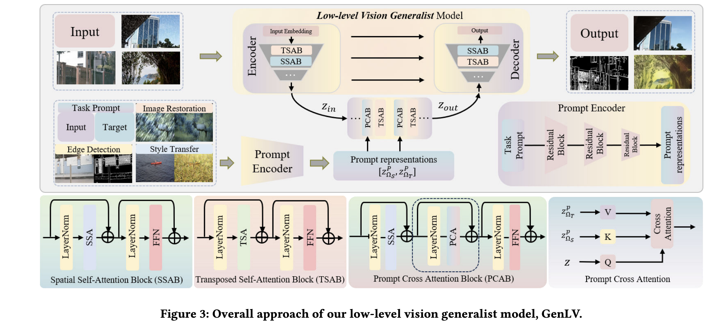
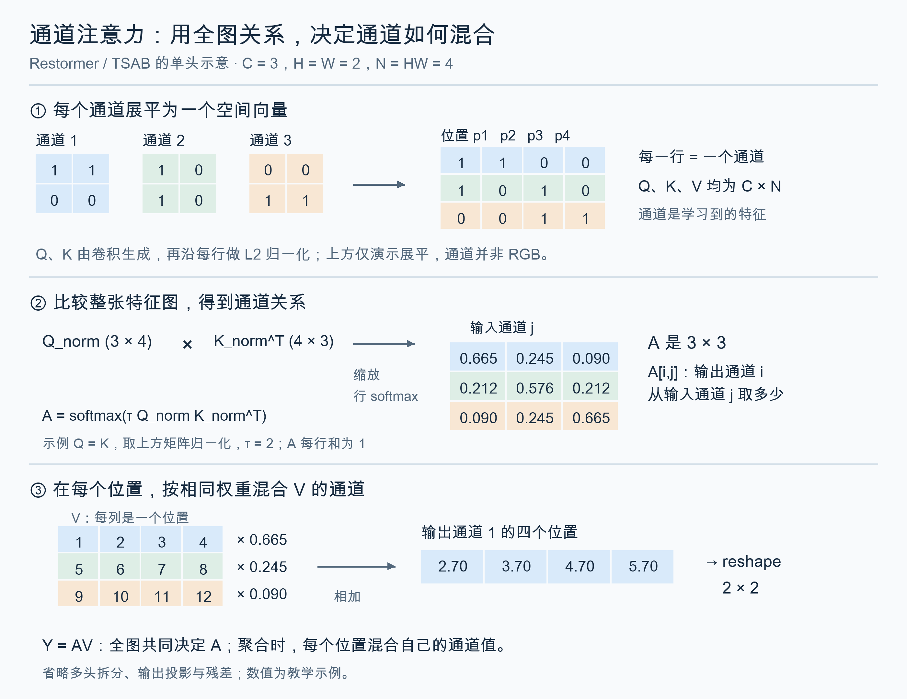

## Overview

这是一个希望给定参考prompt图像对，能够自动识别low-level任务模式并施加相关映射的工作。覆盖恢复、增强、边缘检测和风格化，输出域也可以随prompt改变。

我觉得这是一篇 anti-PromptGIP 的文章。主要针对他们把图像拼成网格再做全局注意力的方式：计算开销大，MAE范式又绑定了ViT骨架，限制了重建质量。VPIP把图像处理和prompt交互拆开，让backbone可以单独选择。

## Formulation

将任务视为源图像域到目标图像域的映射：

$$
\mathcal T:\Omega_S\rightarrow\Omega_T,\qquad
\hat I_{out}=\mathcal F_\theta(I_{in},[P_S,P_T])
$$

$P_S,P_T$ 是同一参考图像处理前后的配对，例如噪声图与干净图。它们示范要做什么，$I_{in}$ 则是实际待处理的另一张图。

## Architecture

依旧魔改Restormer+Prompt Encoder，引入空间注意力和通道注意力，和prompt 交叉注意力模块。

具体采用 X-Restormer 主干，在 U 型结构底部加入 prompt 交叉注意力。整体称为 VPIP 框架。

### Backbone

三次下采样和上采样，同尺度使用 skip connection。交替堆叠两类模块，各自带有 LayerNorm、FFN 和残差：

- **TSAB**：沿通道计算注意力，聚合全图信息。
- **SSAB**：通过重叠窗口计算空间注意力，交换位置之间的信息。

#### Channel Attention

以单头为例，将卷积生成的Q、K、V展平为 $C\times N$，$N=HW$。每行对应一个通道在全图上的响应；Q、K沿空间维度做L2归一化：

$$
A=\operatorname{Softmax}_{\mathrm{row}}(\tau\hat Q\hat K^\top)\in\mathbb R^{C\times C},\qquad Y=AV
$$

$\tau$ 是可学习的缩放参数。$A_{ij}$ 表示输出通道 $i$ 从V的通道 $j$ 取多少信息：

$$
Y_{i,p}=\sum_{j=1}^{C}A_{ij}V_{j,p}
$$

这里用全图计算通道关系，再在每个位置混合通道值。同一张图的所有位置共用这组权重；注意力矩阵是 $C\times C$，空间全局注意力则是 $N\times N$。仅看注意力乘法，复杂度分别为 $O(C^2N)$ 和 $O(N^2C)$。公式按 [Restormer 官方实现](https://github.com/swz30/Restormer/blob/main/basicsr/models/archs/restormer_arch.py#L83-L114) 的排列方式书写。

### Prompt Encoder

使用残差块和下采样，得到参考输入与目标的特征 $z_S^P,z_T^P$，空间尺寸与主干底部的特征一致。

### Prompt Cross-Attention

Q 来自待处理图像，K 来自参考输入，V 来自参考目标。省略多头和输出投影后：

$$
Q=W_Qz,\qquad K=W_Kz_S^P,\qquad V=W_Vz_T^P
$$

$$
\operatorname{PCA}(z,z_S^P,z_T^P)
=\operatorname{Softmax}\left(\frac{QK^\top}{\sqrt d}\right)V
$$

$W_Q,W_K,W_V$ 是 $1\times1$ 卷积，计算前将空间位置展平为 token，$d$ 为每个头的维度。可以理解为：用输入特征匹配参考输入，再从参考目标中提取相应的处理信息。

PCAB 在 SSAB 的空间注意力和 FFN 之间插入 PCA，三步都带有归一化和残差连接。交互后的特征由 decoder 重建为输出图像。

## Training

在 30 个任务上联合训练，输入和prompt图像均为 $256\times256$，直接监督输出：

$$
\mathcal L=\|\mathcal F_\theta(I_{in},[P_S,P_T])-I_{GT}\|_1
$$

推理时通过更换参考图像对指定任务。

## Ablation

他们也做了 **ViT-VPIP vs PromptGIP** 的消融对照：都使用ViT，比较VPIP和原来的MAE拼接范式。仅训练恢复任务时，PromptGIP整体更好；扩展到30个任务后，ViT-VPIP整体更好。说明任务变多时，收益也来自框架改变，不能全部归因于换成X-Restormer。这里比较的是整套框架，也不能把收益只算到PCA模块上。[论文 §4.2](https://arxiv.org/html/2408.08601v1#S4.SS2)

再比较 **GenLV vs ViT-VPIP**，才是在VPIP框架下考察backbone的影响。

## Cons

这里需要区分多任务与新任务泛化。论文也承认，模型对 OOD 未见任务仍缺乏满意的表现；更适合理解为通过prompt选择已学到的任务映射。
