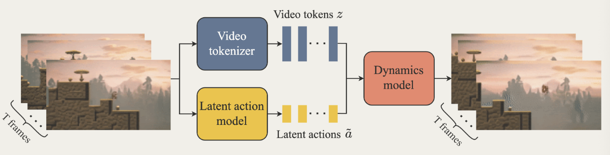
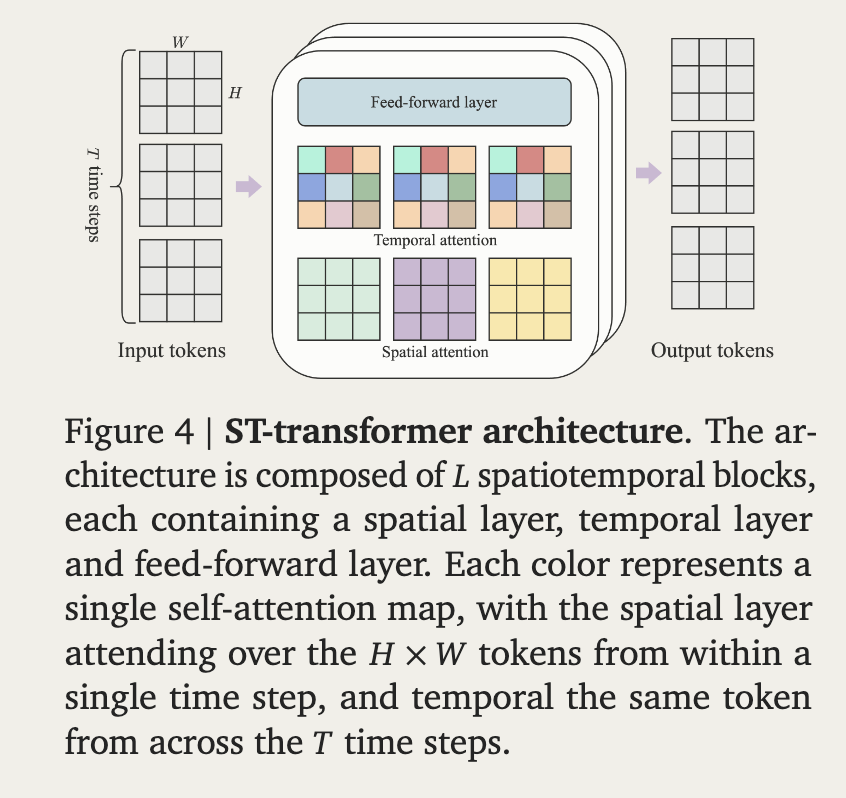

## Overview
Generative Interactive Environment, trained in unsupervised manner from unlabelled Internet videos.

从无标注的网络视频中，以自监督的方法训练出的 **Gen**erative **I**nteractive **E**nvironment

## 2-stage training pipeline
- Train the video tokenizer
- Cotrain latent action model(directly from pixels) and the dynamics model (on video tokens)

## Architecture

由一个时空视频tokenizer (spatialtemporal video tokenizer)、一个自回归动力系统模型、和一个简单可扩展的隐动作模型组成。

### ST-transformer

视频可能包含 $10^4$ 量级的tokens。若总token数为 $N=THW$，全局attention的分数矩阵大小为 $N\times N$，开销随token数量平方增长。这里 $H,W$ 指token网格的高和宽。

此处采用了一个 memory-efficient ST-transformer architecture.

一个 ST-transformer block = Spatial attention(reshape to $BT\times HW$) + Temporal attention(reshape to $BHW \times T$) + FFW

忽略batch和特征维度，attention开销由 $O(T^2H^2W^2)$ 分解为 $O(T(HW)^2+HWT^2)$。空间attention项对帧数 $T$ 是线性的，时间attention项仍是二次的。

理论上是每个attention层之后要加入一个前馈层，但是这里为了scaling性质省略掉了。后来发现这重大的提升了结果水平。

### Video tokenizer

采用VQ-VAE：encoder提取连续特征，通过码本量化成离散tokens，再由decoder重建视频。

$$
x_{1:T}\xrightarrow{\text{encoder}}h_{1:T}
\xrightarrow{\text{VQ}}z_{1:T}
\xrightarrow{\text{decoder}}\hat{x}_{1:T}
$$

Encoder和decoder都使用ST-transformer，因此 $z_t$ 可以包含历史帧 $x_{1:t}$ 的信息，因果mask阻止它看到未来。重建目标促使离散表示保留画面信息，dynamics model随后在这个压缩空间预测。[原论文 §2.1](https://arxiv.org/html/2402.15391v1#S2.SS1)

### Latent action model

训练目标：
- 训练$x_{1:t+1} \mapto a_{1:t}$的编码映射
- 训练从前t帧和t帧的latent action repr 到下一帧的解码映射

这里Genie只用到了编码出来的latent action，只是使用AE架构来强化表示，类似[[AML]]中的自编码器架构。具体的采用了一个VQ-VAE-based objective，并限制了VQ码本的大小来取得human playbility和enforce controlbility。

当然解码器只负责提供训练信号，正如[[AML]]中写的那样。

使用因果mask并行的对帧序列和状态动作序列做处理。

### Dynamics model
视频tokens和隐动作输入，使用[[MaskGIT]]的方法自回归预测下一帧。

Latent action embedding与对应帧的video token embeddings相加，而不是拼接。

MaskGIT = **Masked Generative Image Transformer**，是在离散图像tokens上做 masked token prediction 的生成模型。先用tokenizer把图像压缩成离散tokens，再用双向Transformer学习根据可见tokens补全被遮住的部分，类似BERT的“填空”，但这里填的是图像的离散编码。

训练和生成的区别：
- **训练**：随机选择mask比例，把部分真实tokens替换为 `[MASK]`，根据剩余可见tokens预测被遮住的tokens，只在被mask的位置计算cross-entropy loss。不同mask比例让模型同时学会大范围生成和局部补全。
- **生成**：从全是 `[MASK]` 的token网格开始，每轮并行预测所有被mask的位置；保留置信度较高的预测，把低置信度的位置重新mask，再根据已经确定的tokens继续补全。随着迭代逐步减少mask数量，直到得到完整tokens，最后通过tokenizer的decoder还原成图像。

也就是“先同时猜一遍，留下比较确定的部分，再反复补全”。它不需要按从左到右的固定顺序逐个生成token，而是用多轮并行预测完成一张图像。参见[MaskGIT原论文](https://openaccess.thecvf.com/content/CVPR2022/html/Chang_MaskGIT_Masked_Generative_Image_Transformer_CVPR_2022_paper.html)。

放到Genie里，生成下一帧时还要以历史视频tokens $z_{1:t}$ 和隐动作 $a_{1:t}$ 为条件，在下一帧的token网格上进行上述补全过程。因此这里的**自回归是帧与帧之间的**：先生成第 $t+1$ 帧，再把它作为历史去生成第 $t+2$ 帧；**一帧内部则采用MaskGIT式的迭代并行生成**。对应到ST-transformer，temporal attention保持因果性，spatial attention允许同一帧内的tokens相互关注。参见[Genie原论文](https://arxiv.org/html/2402.15391v1)。

## Train

### Data

使用经过筛选的2D platformer游戏视频，约30k小时，不需要真实动作标签。训练时每个sequence取16帧，帧率10 FPS。

### Stage 1: Video tokenizer

先用VQ-VAE objective训练视频的编码和重建，得到离散video tokens。码本大小为1024，训练300k steps；之后固定tokenizer，供第二阶段使用。

### Stage 2: Latent action + Dynamics model

两个模型同时训练，但各自承担不同的预测任务：

- **LAM**：从原始帧推断latent action，通过重建下一帧和VQ-VAE objective学习表示。动作码本只有8个codes，限制动作能携带的信息量。
- **Dynamics model**：接收video tokens和latent action embeddings，以真实下一帧tokens为target计算cross-entropy。训练时随机mask输入tokens，mask rate从 $[0.5,1]$ 均匀采样；动作作为additive embeddings加入。

这里有一个关键的 **stop-gradient**：传给dynamics model的latent action会截断梯度。因此“同时训练”不意味着dynamics loss会反向更新LAM；LAM通过自己的重建任务学习动作表示。

可以把两条训练信号概括成：

$$
\begin{aligned}
\text{LAM}:&\quad (x_{1:t},a_t)\longrightarrow x_{t+1}\\
\text{Dynamics}:&\quad (\text{video tokens},\operatorname{sg}(\text{action embeddings}))\longrightarrow z_{2:T}
\end{aligned}
$$

### Training setup

最终dynamics model为10.1B参数，batch size 512，训练125k steps，使用bfloat16和QK norm稳定训练。推理时由用户选择动作code，替代LAM的动作推断，再逐帧生成。

训练细节参见[Genie原论文 §2–3、Appendix C–D](https://arxiv.org/html/2402.15391v1)。

## Inference

初始图像编码为 $z_1$ → 用户选择动作code → 查动作码本得到embedding → dynamics model生成下一帧tokens → tokenizer decoder还原图像。持续输入动作即可逐帧推进；此时只保留LAM的码本。[原论文 §2.2](https://arxiv.org/html/2402.15391v1#S2.SS2)

## Experiments

### Metrics

- **FVD ↓**：衡量生成视频与真实视频的特征分布差异。
- **$\Delta_t\mathrm{PSNR}$ ↑**：比较使用视频中推断的动作和随机动作时，对真实帧的重建差距：

$$
\Delta_t\mathrm{PSNR}
=\mathrm{PSNR}(x_t,\hat{x}_t)-\mathrm{PSNR}(x_t,\hat{x}'_t)
$$

$\hat{x}_t$ 使用推断动作，$\hat{x}'_t$ 使用随机动作。差值越大，说明匹配的动作越有助于还原真实轨迹；论文取 $t=4$。[原论文 §3](https://arxiv.org/html/2402.15391v1#S3)

### Training agents

冻结LAM，给专家视频补上latent action标签，再训练behavioral cloning策略。用少量真实动作样本建立latent-to-real映射；CoinRun实验中，200个适配样本即可达到oracle BC的相当成绩。[原论文 §3.3](https://arxiv.org/html/2402.15391v1#S3.SS3)

## Limitations

可能生成不合理的未来；只有16帧记忆，长期一致性有限；论文报告生成速度约1 FPS，交互效率仍不足。[原论文 §5](https://arxiv.org/html/2402.15391v1#S5)
