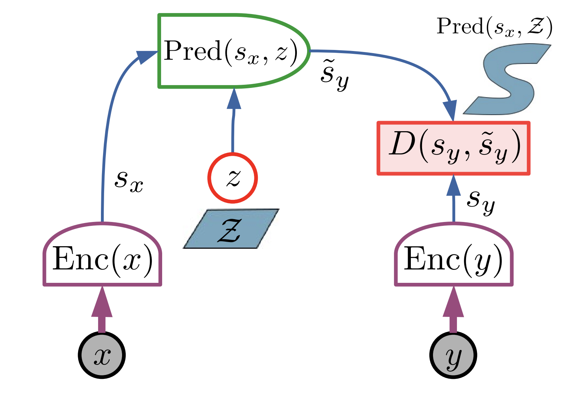

## Overview

按照LeCun的[AML](https://openreview.net/pdf?id=BZ5a1r-kVsf)的§4的思路。

世界模型首先被理解为一个观测世界并形成预测的过程，类似于locke说的对世界的认知只是万物在心灵上的投影。
具体而言，世界模型的信息流入方式被认为是“观测”，也就是说智能体(Or Autonomous Machine)所获得的信息没有真实的标签或者明确的reward。因而监督学习、强化学习等范式必须摒弃。通往世界模型的道路就只剩下SSL(Self-Supervised Learning)一条。

LeCun对SSL的理解非常深刻，在这里他指出 隐变量Latent 是用于解决不确定性的方式。
换言之，隐变量弥合了观测数据到实际现象之间的距离。世界模型就是一个表征这类隐变量的模型。

为了更严谨的表示这个观念，LeCun使用当时风靡的EBM(Energy-based Model)来定义latent，latent是满足

$$
z = min_{z\in \mathcal{Z}} E_w(x,y,z)
$$
即最小化能量函数。

这样我们想要的世界模型就是形如

$$
F_w(x,y) = min_{z\in \mathcal{Z}} E_w(x,y,z)
$$

的模型。

接着LeCun指出要训练这样一个EBM模型，需要解决Collapse的问题,并列举出了四种架构和两种训练方法。

> [!question]
> LeCun在论文中提到
> > It is important to note that contrastive and regularized methods are not incompatible with each other, and can be used simultaneously on the same model.
> > How would regularized methods apply to the architectures of Figure 10(b-d)?
> > 
> > In the latent-variable generative architecture, restricting the information capacity of z will restrict the volume of y space that can take low energy. If z is discrete with possible k values, at most k points in y space will have zero energy. if Z is a manifold of dimension d then the region of y space with zero energy will have at most d dimensions.
> > 
> > Similarly, in the auto-encoder architecture, restricting the information capacity of sy will restrict the volume of y space that can be reconstructed with low energy.
> > 
> > Lastly, in the Joint Embedding Architecture, Maximizing the information that sx contains about x and sy contains about y will minimize the volume of y space that can take low energy.
> 不是很懂这个用意

> [!claude]
> Collapse的本质是模型找到了平凡解,对几乎所有的y都给出低能量,从而失去了区分能力。从几何角度看,给定输入x,我们可以定义低能量区域为$\mathcal{Y}_x = \{y: E_w(x,y,z) < \epsilon\}$。理想情况下,$\mathcal{Y}_x$应该是一个点或由真实数据分布决定的低维流形;而collapse意味着$\mathcal{Y}_x = \mathcal{Y}$,整个输出空间都被赋予了低能量。
> 
> 防止Collapse有两大类方法。Contrastive方法显式地提高负样本的能量,可以理解为主动"挖坑";而Regularized方法通过限制模型的表达能力,使其在物理上无法给太多点赋予低能量,相当于被动"封顶"。
> 
> LeCun用信息论的统一视角来解释regularized方法如何防止collapse。核心观点是:通过限制中间表征的信息容量,可以控制低能量区域的体积。
> 
> 考虑离散情况,如果隐变量z只能取k个离散值,那么z最多能"指定"k个不同的输出,因此$|\mathcal{Y}_x| \leq k$。连续情况下,如果Z是d维流形,那么解码器输出的像也最多是d维的。当输出空间$\mathcal{Y}$本身是D维且$D \gg d$时,低能量区域只占测度为零的子集:$\text{dim}(\mathcal{Y}_x) \leq d < D = \text{dim}(\mathcal{Y})$。
> 
> 这个原理在三种架构中有不同的体现。对于Latent-variable generative架构,限制z的信息容量就限制了可生成的y的体积;对于Auto-encoder架构,限制编码$s_y$的容量就限制了可重建的y的体积。而Joint Embedding架构(JEPA的核心)则采取了相反的策略:最大化$s_x$关于x、$s_y$关于y的信息。
> 
> 第三种架构的巧妙之处在于,它要求表征保留所有判别性信息。如果模型collapse给所有y低能量,那么$s_y$就无法区分不同的y,这与"最大化信息"的目标矛盾。因此信息最大化本身就构成了一种隐式的正则化。这为I-JEPA提供了理论基础:不需要显式的对比学习,通过最大化表征的信息量就能防止collapse。

接着LeCun指出，JEPA正是JEA和Latent-Variable Generative Model 的融合。

提出JEPA能使用两种架构来表达x，y之间的复杂依赖：1. Encoder Invariance 2. Latent-Variable Predictor。 简而言之就是利用抽象性和保留多样性。

接着谈及JEPA架构的训练问题，提出了四条准则：最小化隐变量容量，最大化Enc(x), Enc(y)信息，最小化预测误差，并且给出了一些具体的方法。

VICReg是将"最大化表征信息"转化为可计算损失的具体实现。它用三个损失项训练：Variance损失确保每个维度有足够变化范围，Covariance损失使不同维度相互独立，以及标准的Prediction损失。前两项共同实现了信息最大化：高方差意味着每个维度都被利用，低协方差意味着不同维度携带独立信息。与传统对比学习在样本维度对比不同，VICReg在特征维度对比，因此不需要大量负样本。

关于"最小化隐变量容量"，LeCun通过一个思想实验说明了其必要性：如果z的维度等于$s_y$，预测器可以选择忽略$s_x$而直接令$\tilde{s}_y = z$，那么对任何$s_y$都可以设置$\hat{z} = s_y$使能量为零，导致完全collapse。防止这种情况的方法是限制z的信息容量，具体手段包括：离散化（如VQ-VAE的codebook，z只能取K个值，则最多K个点有零能量）、降维（z的维度d小于$s_y$，则低能量区域最多是d维流形）、稀疏化（L1正则使z稀疏，低能量区域变成低维子空间的并集）、以及随机化（如VAE中最大化熵）。这些方法通过控制z能"指定"的输出数量，从几何上限制了低能量区域的体积。
