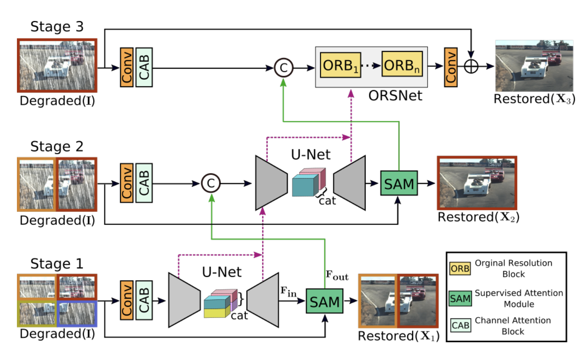
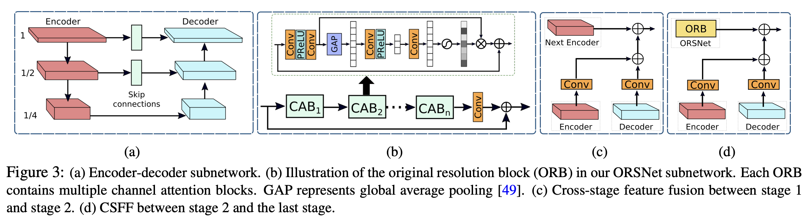
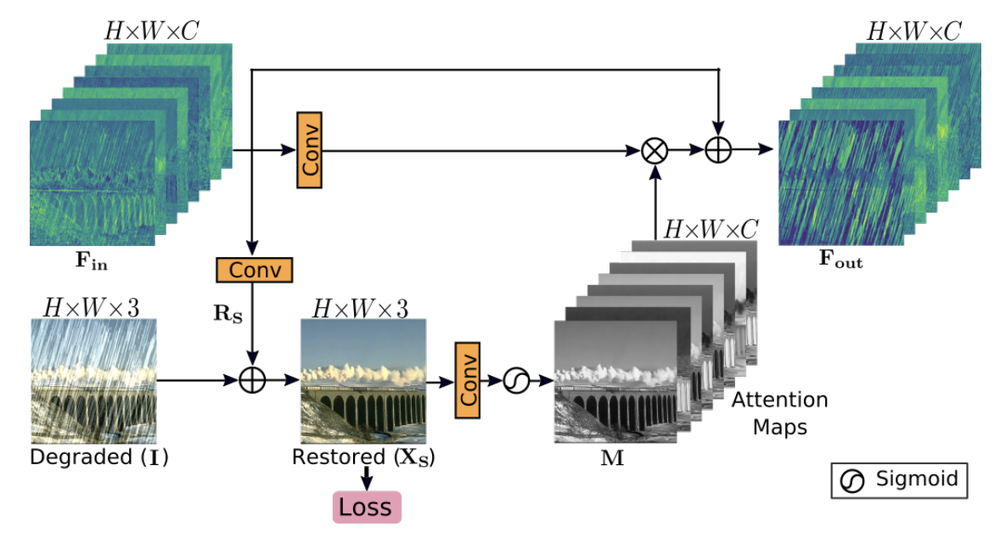

## Overview

MPRNet（CVPR 2021）通过**三个阶段逐步恢复图像**：前两阶段用 U-Net 获取多尺度上下文，最后一阶段保持原分辨率修复细节。阶段之间通过 **SAM 筛选输出特征，CSFF 复用中间特征**。

核心贡献是不同阶段的分工与特征交互。去雨、去模糊和去噪分别训练模型。

## Architecture

输入按 **四块→两块→整图** 逐步扩大处理区域，切块保留原像素分辨率。

| 阶段 | 处理流程 | 作用 |
| --- | --- | --- |
| Stage 1 | 四块分别编码，左右特征拼成上下两组后解码 | 提取局部与多尺度特征 |
| Stage 2 | 两个半图分别编码，上下特征拼成整图后解码 | 扩大区域间的信息交互 |
| Stage 3 | 整图进入原分辨率网络 ORSNet | 结合上下文修复细节 |

### 特征在哪里拼接？

设编码器某尺度的下采样倍数为 $d\in\{1,2,4\}$，该尺度通道数为 $C_d$。特征通过**空间拼接**对齐下一阶段覆盖的图像区域，拼接本身不做插值：

| 位置 | 拼接方式 | 尺寸变化（$H\times W\times C$） |
| --- | --- | --- |
| Stage 1 编码器 → 解码器 | 各尺度的左、右特征沿**宽度**拼接，上下两组分别处理 | 两个 $\frac{H}{2d}\times\frac{W}{2d}\times C_d$ → $\frac{H}{2d}\times\frac{W}{d}\times C_d$ |
| Stage 2 编码器 → 解码器 | 各尺度的上、下特征沿**高度**拼接 | 两个 $\frac{H}{2d}\times\frac{W}{d}\times C_d$ → $\frac{H}{d}\times\frac{W}{d}\times C_d$ |

因此，Stage 1 的编码器特征拼成半图后，与半图解码器特征一起通过 CSFF 送入 Stage 2；Stage 2 的编码器特征拼成整图后，与整图解码器特征一起送入 Stage 3。

另外两处是**通道拼接**：Stage 2 入口将半图浅层特征与 Stage 1 的 SAM 特征拼接；Stage 3 入口将整图浅层特征与 Stage 2 的 SAM 特征拼接。二者空间尺寸已一致，拼接只增加通道数，随后用卷积融合。

Stage 2 → ORSNet 的低分辨率 CSFF 特征则通过 **2 倍 / 4 倍上采样**对齐到 $H\times W$，再相加，不靠拼接放大。

每阶段都从原始退化图像 $I$ 提取浅层特征，并预测图像残差：

$$
\hat I_s=I+R_s,\qquad s=1,2,3
$$

下一阶段的输入由原图浅层特征与上一阶段的 SAM 特征拼接、卷积融合得到。三个阶段联合训练，各自接受干净图像监督。

### U-Net 与 ORSNet

**U-Net** 通过下采样扩大感受野，再通过上采样和跳跃连接恢复空间信息；各尺度使用 CAB 提取特征。

**CAB（Channel Attention Block）** 先做卷积变换，再用全局平均池化和两层通道映射生成权重，对各通道加权，最后加回输入残差。同一通道的权重在所有空间位置共享。

**ORSNet（Original Resolution Subnetwork）** 不做下采样，堆叠三个 ORB；每个 ORB 由多个 CAB、卷积和残差连接组成。它保持空间细节，同时通过 CSFF 接收前一阶段的多尺度上下文。

## SAM：用恢复结果筛选特征

SAM（Supervised Attention Module）位于相邻阶段之间。先由特征 $F$ 预测恢复图，再由恢复图生成注意力：

$$
\hat I=I+W_r*F,\qquad M=\sigma(W_m*\hat I)
$$

$$
F_{\mathrm{out}}=F+(W_f*F)\odot M
$$

$W_r,W_m,W_f$ 为 $1\times1$ 卷积，$\odot$ 为逐元素乘法。$M\in\mathbb R^{H\times W\times C}$ 随位置和通道变化，调节传给下一阶段的特征。

**监督施加在恢复图 $\hat I$ 上**，使注意力与恢复任务关联；无需注意力标签，推理也不需要 GT。

## CSFF：复用跨阶段多尺度特征

CSFF（Cross-Stage Feature Fusion）将前一阶段的**编码器和解码器特征**传给下一阶段，减少重复编解码造成的信息损失。

**Stage 1→2**：在对应尺度，将前一阶段特征经过独立的 $1\times1$ 卷积后，加到当前编码器特征上：

$$
E_{2,l}\leftarrow E_{2,l}+P_l^E(E_{1,l})+P_l^D(D_{1,l})
$$

$E_{s,l},D_{s,l}$ 分别表示阶段 $s$、尺度 $l$ 的编码器和解码器特征；图像块特征先拼接到对应区域。

**Stage 2→3**：将三个尺度的特征分别对齐到原分辨率、投影通道数，再依次加到三个 ORB 的输出上。

SAM 传递的是**恢复结果引导的输出特征**，CSFF 传递的是**不同尺度的中间特征**。这就是论文所说的跨阶段多尺度聚合。

## Training

三个阶段均使用 Charbonnier loss 和 edge loss：

$$
\mathcal L=\sum_{s=1}^{3}\left[
\mathcal L_{\mathrm{char}}(\hat I_s,Y)+\lambda\mathcal L_{\mathrm{edge}}(\hat I_s,Y)
\right]
$$

$$
\mathcal L_{\mathrm{char}}=\sqrt{\|\hat I_s-Y\|^2+\epsilon^2}
$$

$$
\mathcal L_{\mathrm{edge}}=\sqrt{\|\Delta(\hat I_s)-\Delta(Y)\|^2+\epsilon^2}
$$

$Y$ 为干净图像，$\Delta$ 为 Laplacian 算子，$\epsilon=10^{-3}$，$\lambda=0.05$。两项分别约束像素重建和边缘恢复。

## Discussion

**创新点**：用 U-Net 与原分辨率网络互补处理上下文和细节，再通过 SAM、CSFF 建立两条跨阶段特征通路。贡献在于整体协作设计，U-Net、通道注意力和多阶段恢复本身已有前作。

**提升幅度**：相对论文中的对比方法，去雨五数据集平均 PSNR 提升 1.98 dB，GoPro 去模糊提升 0.81 dB，SIDD 去噪提升 0.19 dB。去雨提升最明显；其中 +1.98 dB 对应约 20.4% 的 RMSE 降低，并非 PSNR 数值增长 20%。

**模块贡献**：三阶段消融中，不加 SAM / CSFF 为 29.86 dB，仅加 CSFF 为 30.07，仅加 SAM 为 30.31，两者都加为 30.49。两条通路均有效；该消融训练预算较小，不能直接与完整模型的 32.66 dB 比较。

来源：[论文](https://arxiv.org/pdf/2102.02808) · [官方网络实现](https://github.com/swz30/MPRNet/blob/main/Deblurring/MPRNet.py) · [损失实现](https://github.com/swz30/MPRNet/blob/main/Deblurring/losses.py)
