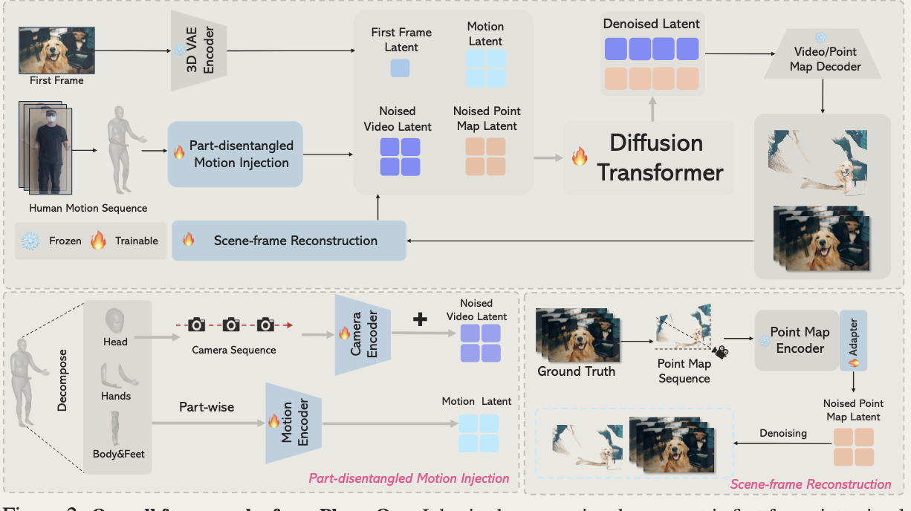
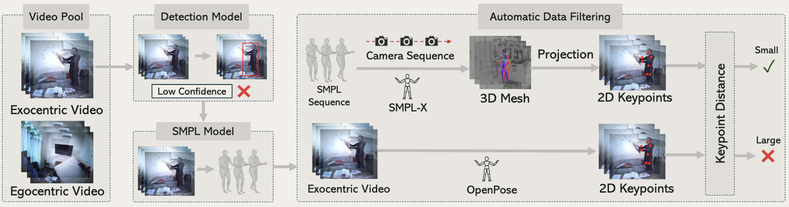

## Overview

宣称第一人称真实世界生成，给定一张第一人称场景图像，就能够输出严格对齐于真实场景相机拍摄的人类运动数据的视频。

本工作宣称了两个主要的模块：
1. Part-disentangled Motion Injection(PMI) 
2. Scene-frame reconstruction(SR)

PMI 首先将整体的 Motion 数据划分成头部、手部、身体与脚三个部分，各部分分别经一个八层 3D CNN Motion Encoder 编码后，沿通道拼接得到 motion latent；头部 Motion 还会被转成仅有旋转（平移置零）的相机外参并经 Plücker ray 参数化，由结构与 Motion Encoder 类似的 Camera Encoder 编码成 $z_{cam}$，加到（带噪的）$z_{video}$ 上以注入视角变化信息。

而 SR 模块负责从训练视频渲染点图序列：用 [[CUT3R]] 渐进重建各帧点图（利用第 1 至 n 帧重建第 n 帧），点图先经 Point Map Encoder（取自 [[Geo4D]]）压缩，再经 5 层 3D 卷积的 Adapter 变换为与 $z_{video}$ 对齐的 $z_{point}$（通道数 64：k×64×h×w）。点图序列在推理阶段并不需要。

本工作采用 Coarse-to-fine 的分阶段训练，并在最后做蒸馏加速（详见 Training Strategy）：
1. 在大规模第一人称文本-视频对上的预训练
2. 在由第一人称-第三人称（ego-exo）成对视频数据提取的同步运动对上的微调
3. 不对称蒸馏：用双向教师监督因果学生，实现实时、长时生成

## Data Preprocessing

流程是：

1. 用 [[SAM2]] 从第三人称视角中分割出最大的人物并去除背景；再由 SMPLest-X（SMPL 参数估计模型，配合 L2 正则先验以稳定优化）估计 [[SMPL]] 参数作为运动表示。
2. 用 [[SMPLX]] 重建 3D 人体网格，将 3D 关节重投影到 2D 平面，与 [[OpenPose]] 检测的 2D 关键点计算重投影误差，剔除误差最大的前 10%，从而获得高质量运动-视频对。
3. 过滤后的 SMPL 参数逐帧分解为身体与脚（66 维）、头部朝向（3 维）、双手手部姿态（各 45 维），供三个 Motion Encoder 分别使用。

同步数据取自 EgoExo-4D、Nymeria、FT-HID、EgoExo-Fitness 等 ego-exo 成对数据集。

## Input Construction

各模块产出的 latent——首帧 $z_{frame}$、运动 $z_{motion}$、点图 $z_{point}$，以及加噪的视频 $z_{video}$（$z_{cam}$ 已直接加在 $z_{video}$ 上）——沿通道拼接后作为 DiT 的输入。

训练时 $z_{frame}$、$z_{motion}$、$z_{cam}$ 固定作为条件，只有 $z_{video}$ 与 $z_{point}$ 被加噪/去噪（即 $z_0 = z_{video} \otimes z_{point}$）。推理时只需要首帧图像与人体运动序列，点图序列不再需要。

## Training Strategy

1. Stage1: 在大规模第一人称文本-视频数据（EgoVid-5M）上，用 LoRA（rank=128，更新权重 4）对基线模型 Wan2.1 1.3B（Wan et al. 2025，开源视频生成 DiT）进行微调，使其能够生成具有粗略运动对齐的第一人称视频。
2. Stage2: 冻结LoRA，并用构建的高质量数据集微调模型的最后六个模块（Transformer Block），以增强细粒度的人体运动对齐和视角不变的场景建模。
3. 不对称蒸馏（asymmetric distillation）：在微调之后用蒸馏换取实时性——双向教师（attention 可同时覆盖过去与未来帧）监督“因果”学生模型（只能看到历史帧、可流式自回归解码），使蒸馏后的模型能以约 8 FPS 实时生成长时视频。蒸馏方法取自 Yin et al. 2025（From Slow Bidirectional to Fast Autoregressive Video Diffusion Models，CVPR 2025）。

## Related

蒸馏：

世界模型：感觉这个和Atlas很像，都建模了一个spatial信息（此处是Point Map Latent）
