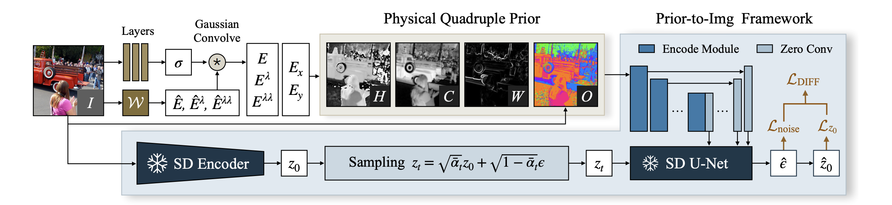
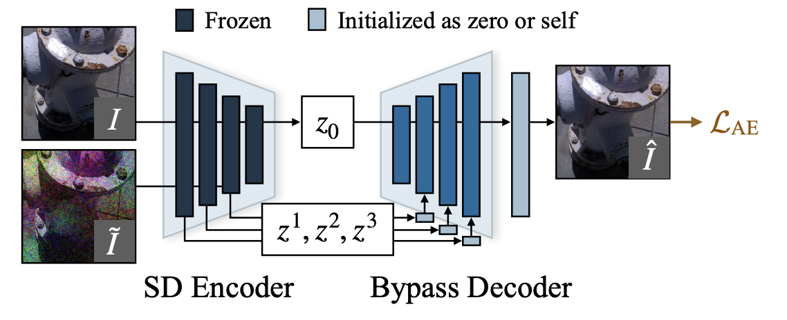

## Overview

使用 Kubelka–Munk 光传输模型推导光照不变量 $H,C,W$，并结合 RGB 通道排序 $O$，构成 **physical quadruple prior**。再用 Stable Diffusion + ControlNet 学习从先验重建正常光图像。

核心是把低光增强改写为 **prior-to-image**：训练时只用正常光图像 $I_N$，学习 $P(I_N)\rightarrow I_N$；推理时输入低光图像的先验 $P(I_L)$，利用两者的近似光照不变性，生成正常光结果。

这里的 zero-reference 指不需要低光—正常光配对，也不需要低光训练集；并不意味着不训练或不使用正常光图像。亮度分布来自正常光数据及预训练生成模型，而非手工指定的目标曝光值。

## Physical Quadruple Prior

### Kubelka–Munk Model

论文使用的光传输形式为：

$$
E(\lambda,\mathbf x)=e(\lambda,\mathbf x)\left[(1-i(\mathbf x))^2R_\infty(\lambda,\mathbf x)+i(\mathbf x)\right]
$$

$E$ 是观测光谱能量，$e$ 是光源光谱，$i$ 表示镜面反射项，$R_\infty$ 是材料反射率。若表面近似哑光，即 $i\approx0$，就退化为 Retinex 式的 $E=eR_\infty$。

思路是通过导数与比值消去光照相关项，保留与材料有关的信息。记 $E^\lambda=\partial E/\partial\lambda$、$E^{\lambda\lambda}=\partial^2 E/\partial\lambda^2$，分别表示光谱的一阶、二阶导数；它们与空间梯度 $\nabla E$ 不同。

### H / C / W / O

**H：与色相有关。** 假设等能量照明，即光源能量不随波长变化，$e(\lambda,\mathbf x)=\tilde e(\mathbf x)$：

$$
\frac{E^\lambda}{E^{\lambda\lambda}}
=\frac{\tilde e(1-i)^2R_\infty^\lambda}{\tilde e(1-i)^2R_\infty^{\lambda\lambda}}
=\frac{R_\infty^\lambda}{R_\infty^{\lambda\lambda}},\qquad
H=\arctan\left(\frac{E^\lambda}{E^{\lambda\lambda}}\right)
$$

**C：与色度有关。** 在上述条件上进一步假设哑光表面，便可用强度归一化光谱变化：

$$
C=\log\left(\frac{(E^\lambda)^2+(E^{\lambda\lambda})^2}{E^2}\right)
=\log\left(\frac{(R_\infty^\lambda)^2+(R_\infty^{\lambda\lambda})^2}{R_\infty^2}\right)
$$

**W：保留归一化空间梯度。** 再假设照明在空间上均匀，即 $\tilde e(\mathbf x)=\bar e$，则 $\nabla E/E=\nabla R_\infty/R_\infty$。正文 Eq. (11) 写作：

$$
W_{\mathrm{paper}}=\tan\left(\left\|\frac{\nabla E}{E}\right\|\right)
$$

它提供局部结构与对比变化信息。这里的假设强于 $H,C$：若光照本身有空间梯度，$\nabla E/E$ 也会包含光照变化，不能认为对任意阴影严格不变。

**O：补充颜色次序。** 对每个像素的 RGB 通道分别记录大小排名，归一化到 $[-1,1]$：

$$
O=[O_R,O_G,O_B]
$$

例如 $R>G>B$ 时为 $[1,0,-1]$。它假设光照变化保持通道顺序，用来弥补前三项丢失的颜色信息。[论文 §2.2](https://arxiv.org/html/2403.12933v1#S2.SS2)

### Learnable Extraction

RGB 图像没有完整光谱，因此先通过可学习的 $3\times3$ 矩阵近似光谱能量及导数：

$$
\begin{bmatrix}\hat E\\\hat E^\lambda\\\hat E^{\lambda\lambda}\end{bmatrix}
=\mathcal W\begin{bmatrix}R\\G\\B\end{bmatrix}
$$

再用尺度为 $\sigma$ 的高斯平滑与高斯导数滤波器，计算 $E,E^\lambda,E^{\lambda\lambda},E_x,E_y$，代入上述公式。$\mathcal W$ 与预测尺度的网络跟随 prior-to-image 任务学习；先验既有物理形式约束，也有数据驱动的适应能力。因此 $H,C$ 不应直接等同于 HSV 中的 H、S。

## Architecture

### SD Encoder and SD U-Net

使用 Stable Diffusion v1.5，固定原有 VAE encoder 和去噪 U-Net。训练时由正常光图像得到目标 latent：

$$
z_0=\mathcal E(I_N),\qquad
z_t=\sqrt{\bar\alpha_t}z_0+\sqrt{1-\bar\alpha_t}\epsilon,
\quad\epsilon\sim\mathcal N(0,I)
$$

$\bar\alpha_t=\prod_{s=1}^t\alpha_s$，随机采样时间步 $t$，用条件去噪网络预测噪声。

### ControlNet Branch

先验 $P(I_N)$ 经可训练的卷积与 Transformer 模块编码，通过 zero convolution 将条件特征注入冻结的 SD U-Net：

$$
\hat\epsilon=\epsilon_{\theta_{\mathrm{SD}},\phi}(z_t,t,P(I_N),c_\varnothing)
$$

$\theta_{\mathrm{SD}}$ 固定，$\phi$ 表示可训练的条件分支；$c_\varnothing$ 是空字符串的文本条件，训练、推理都不需要用户描述图像。Zero convolution 的权重从零开始，使新增分支初始时不会扰乱预训练模型。

提取训练先验时还会给输入添加 Gaussian–Poisson 混合噪声，但重建目标仍是原图，引导模型对先验中的噪声保持鲁棒。

### Bypass Decoder

这是图像解码端的改动，与 ControlNet 条件分支是两个模块。即便 latent 准确，原始 SD VAE decoder 也会损坏文字、人脸等细节。

训练 bypass decoder 时，将正常光图像 $I_N$ 做随机光照扰动并加噪得到 $\tilde I$，用原图的 latent $z_0=\mathcal E(I_N)$，结合扰动图像的多尺度 encoder 特征重建原图：

$$
\hat I_N=\mathcal D_{\mathrm{bypass}}
\left(z_0,z^1(\tilde I),z^2(\tilde I),z^3(\tilde I)\right)
$$

增加卷积层融合旁路特征，并加入残差块做后处理；新增层采用零初始化或恒等初始化。训练策略让 decoder 从旁路取细节，同时保留目标 latent 中的正常光照，而非复制旁路图像的亮度。

推理时，旁路特征来自真实低光输入 $I_L$，主 latent 则来自条件扩散生成的 $\hat z_0$。[论文 Fig. 5–6](https://arxiv.org/html/2403.12933v1#S2.SS3)

### Loss Function

扩散部分同时约束噪声预测和干净 latent：

$$
\mathcal L_{\mathrm{noise}}=\|\epsilon-\hat\epsilon\|_2^2,\qquad
\hat z_0=\frac{z_t-\sqrt{1-\bar\alpha_t}\hat\epsilon}{\sqrt{\bar\alpha_t}}
$$

$$
\mathcal L_{z_0}=\|z_0-\hat z_0\|_2^2,\qquad
\mathcal L_{\mathrm{DIFF}}=\mathcal L_{\mathrm{noise}}+\mathcal L_{z_0}
$$

论文报告加入 $\mathcal L_{z_0}$ 可以加快收敛。这里 $\hat z_0$ 是从噪声预测代数还原的，并非另加一个独立预测头。[论文 Eq. (14)–(17)](https://arxiv.org/html/2403.12933v1#S2.SS3)

**理解：** 将前向加噪公式代入，可得同一个时间步上的关系：

$$
\mathcal L_{z_0}=\frac{1-\bar\alpha_t}{\bar\alpha_t}\mathcal L_{\mathrm{noise}},\qquad
\mathcal L_{\mathrm{DIFF}}=\frac{1}{\bar\alpha_t}\mathcal L_{\mathrm{noise}}
$$

因此它等价于对噪声误差按时间步重新加权，更强调高噪声阶段。以上是直接由论文公式得到的解释；这些公式描述的是扩散训练目标，不应混同于 bypass decoder 的图像重建训练。

## Training and Inference

| 环节 | 输入与目标 | 学习/使用的内容 |
| --- | --- | --- |
| Prior-to-image 训练 | 正常光图像的先验与加噪 latent → 噪声、干净 latent | 学习先验提取器和 ControlNet 条件分支，冻结 SD encoder、U-Net |
| Bypass decoder 训练 | 原图 latent + 扰动图像的 encoder 特征 → 原图 | 学习利用旁路恢复细节，保留目标光照 |
| 低光推理 | 低光先验 + 纯高斯噪声 → 正常光 latent | 反向扩散后，用低光 encoder 特征辅助解码 |

推理数据流可以概括为：

$$
P_L=P(I_L),\qquad
\hat z_0=\operatorname{Sample}_{\mathrm{SD+ControlNet}}(\epsilon_T\mid P_L,c_\varnothing)
$$

$$
\hat I_N=\mathcal D_{\mathrm{bypass}}\left(\hat z_0,z^1(I_L),z^2(I_L),z^3(I_L)\right)
$$

注意扩散采样从**纯噪声**开始；低光输入通过先验和 decoder 旁路两条路径约束结果，并不是把低光 latent 加噪后再做普通 img2img。

论文训练使用 COCO-2017 train 和 unlabeled 数据，Adam，学习率 $10^{-4}$，batch size 8，共 140k steps，约 5 epochs；使用 FP16 与 DeepSpeed。推理采用 DPM-Solver++，正文讨论的是 10 步采样。[论文 §2.3、§3.1](https://arxiv.org/html/2403.12933v1#S3.SS1)

## Lightweight Distillation

用完整模型生成约 1.7k 个伪监督样本，再训练一次前向即可输出增强图像的轻量 U-Net：主体为残差块，bottleneck 加入 Restormer Transformer blocks，使用 $L_1$ 损失拟合教师结果。

论文报告参数从约 1.3G 降至 327.36k，在 Tesla M40 上处理 $1024\times1024$ 图像约 0.03 秒，速度约提升 500 倍。这是论文特定配置下的测试结果。

轻量版在 LOL 上 PSNR 为 20.45 dB、LPIPS 为 0.290；完整版分别为 20.31 dB、0.202。因此“效果相近”主要体现于部分指标，感知质量仍有取舍。轻量学生的训练使用教师生成的增强结果，应与完整版只用正常光图像学习映射的设定区分。[论文 §3.3](https://arxiv.org/html/2403.12933v1#S3.SS3)

## Experiments

### Benchmark

论文的 LOL 测试合并 LOL v1/v2 官方测试集，共 **115 对**；MIT-Adobe FiveK 采用 500 对测试图。不能将这里的 LOL 数字直接与仅测 LOL-v1 的结果比较。无配对测试集由 LIME、NPE、MEF、DICM、VV 组成。

| 方法（训练集） | LOL PSNR ↑ | LOL SSIM ↑ | LOL LPIPS ↓ | MIT PSNR ↑ | MIT SSIM ↑ | MIT LPIPS ↓ |
| --- | --- | --- | --- | --- | --- | --- |
| Zero-DCE（自有数据） | 17.64 | 0.572 | 0.316 | 13.53 | 0.725 | 0.201 |
| NeRCo（LSRW） | 19.67 | 0.720 | 0.266 | 17.33 | 0.767 | 0.208 |
| QuadPrior（COCO） | 20.31 | 0.808 | 0.202 | 18.51 | 0.785 | 0.163 |
| Retinexformer（LOL，有监督） | 28.48 | 0.877 | 0.117 | 13.87 | 0.692 | 0.222 |

QuadPrior 在两类数据上取得较均衡的结果，无配对测试集的 BRISQUE/NL 为 14.64/0.423。它的优势是对低光训练域依赖较少；主表也显示，同域有监督方法在 LOL 上仍明显更强，不能概括为全面超过有监督方法。[论文 Table 1、§3.1–3.2](https://arxiv.org/html/2403.12933v1#S3)

### Ablation

| 变体 | LOL PSNR ↑ | SSIM ↑ | LPIPS ↓ |
| --- | --- | --- | --- |
| 去掉 $H$ | 17.60 | 0.756 | 0.262 |
| 去掉 $C$ | 17.60 | 0.762 | 0.262 |
| 去掉 $W$ | 17.77 | 0.749 | 0.291 |
| 去掉 $O$ | 18.63 | 0.764 | 0.285 |
| 使用原始 SD decoder | 19.26 | 0.665 | 0.243 |
| 完整版（消融表） | 20.25 | 0.807 | 0.199 |

四项先验具有互补性：缺少 $H/C$ 容易偏色或泛白，缺少 $W$ 会丢失局部明暗变化，缺少 $O$ 会发生颜色混淆。Decoder 的 SSIM 差距也说明，仅靠扩散生成 latent 不足以保证细节准确。

消融还比较了 HSV 的 HS 通道、CIConv 与 PairLIE 估计的反射率，它们的整体重建质量弱于四重先验。主表和消融表的完整模型数字略有差异，上面按原表分别记录。[论文 Table 2、Fig. 8–10](https://arxiv.org/html/2403.12933v1#S3.SS3)

## Discussion

以下是基于方法和实验的理解：

- **贡献在于连接两个光照域的表示。** 训练时没有见过低光输入，增强能力依赖于低光与正常光的先验足够接近，以及生成模型学到正常光分布。
- **物理不变性有适用条件。** 有色照明、空间变化的光照、强镜面反射、通道饱和或极低信噪比，都可能破坏对应假设。可学习 RGB 映射和自适应尺度也意味着最终特征只是受物理启发，不能把理想推导直接当成严格保证。
- **去除光照与保留内容存在取舍。** 先验丢失的信息需要生成模型补全，输出可能合理但不完全忠实。Bypass decoder 缓解细节失真，但对原图中已经不可辨识的内容仍无保证。
- **可以继续验证先验是否真的跨域对齐。** 例如对同一场景不同曝光，逐项测量先验差异，并分别控制色温、噪声和局部阴影；这比仅做最终增强指标更直接地检验核心假设。
