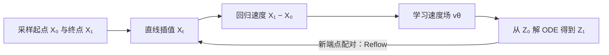

# Rectified Flow

## Overview

Rectified Flow 学习从源分布 $\pi_0$ 到目标分布 $\pi_1$ 的确定性连续搬运。图像生成时，$\pi_0$ 通常是标准高斯噪声，$\pi_1$ 是图像数据分布；把两端换成不同数据域，也可以用于图像转换。

核心区别：**训练时用两点间的直线提供速度监督，生成时沿模型学到的 ODE 轨迹前进。** 初次训练得到的轨迹不一定是直线；Reflow 用模型生成的新起终点配对再次训练，使轨迹更直、少步采样更准确。

## 关键公式

### 1. 直线插值提供监督方向

取 $(X_0,X_1)$ 为 $\pi_0$、$\pi_1$ 的一个配对。无配对数据时，论文通常独立采样 $X_0\sim\pi_0$、$X_1\sim\pi_1$。随机取 $t\sim\operatorname{Uniform}[0,1]$，定义

$$
X_t=(1-t)X_0+tX_1,
\qquad
\dot X_t=X_1-X_0.
$$

训练目标是在位置 $X_t$、时间 $t$ 预测这条直线的速度：

$$
\boxed{
\mathcal L(\theta)
=\mathbb E_{(X_0,X_1),t}
\left[\left\|v_\theta(X_t,t)-(X_1-X_0)\right\|^2\right]
}
$$

模型输入是当前点和时间，监督信号是终点减起点；这是普通的平方误差回归，不需要在训练时求解 ODE。

### 2. 速度场为何会改变原始配对

若多条直线在同一位置、同一时间经过，可能要求不同方向。平方误差的理想最优解为条件平均：

$$
v^*(x,t)=\mathbb E[X_1-X_0\mid X_t=x].
$$

因此学到的速度场并不逐条复制原始直线，而是在相遇处综合局部方向。由这个速度场形成的 ODE 会重新连接起点和终点，得到新的配对 $(Z_0,Z_1)$。

### 3. 生成时解 ODE

从 $Z_0\sim\pi_0$ 出发，沿学到的速度场积分：

$$
\frac{dZ_t}{dt}=v_\theta(Z_t,t),
\qquad t\in[0,1].
$$

生成时只需 $Z_0$ 和 $v_\theta$，不需要预先知道某个 $X_1$。用 $N$ 步欧拉法时，更新为

$$
z_{(i+1)/N}
=z_{i/N}+\frac1N v_\theta\!\left(z_{i/N},\frac{i}{N}\right),
\qquad i=0,\ldots,N-1.
$$

若流完全匀速笔直，$v(Z_t,t)=Z_1-Z_0$ 沿轨迹保持常数，一步欧拉更新 $Z_1=Z_0+v(Z_0,0)$ 就是精确的。一般情况下，单步更新只是近似。

## Algorithm 1：训练、采样与 Reflow

1. **初次训练**：反复采样 $(X_0,X_1,t)$，构造 $X_t$，用 $X_1-X_0$ 监督 $v_\theta(X_t,t)$。
2. **采样**：从 $Z_0\sim\pi_0$ 出发，数值求解 ODE，得到 $Z_1$。
3. **Reflow（可选）**：保留同一条模型轨迹的端点配对 $(Z_0,Z_1)$，用它们替代最初的 $(X_0,X_1)$，重复第 1 步训练新速度场。此时配对来自前一轮模型，不再是独立抽取的两端样本。
4. **蒸馏（可选）**：在最后用端点配对训练直接映射 $T(Z_0)\approx Z_1$，进一步优化一步生成。

## 理论性质与边界

- **保持边缘分布**：在精确速度场、ODE 解存在且唯一等条件下，$\operatorname{Law}(Z_t)=\operatorname{Law}(X_t)$ 对每个 $t$ 成立，特别是 $Z_1\sim\pi_1$。两种过程的整条轨迹和起终点配对仍可不同。
- **降低凸运输成本**：理想条件下，对任意凸函数 $c$，有 $\mathbb E[c(Z_1-Z_0)]\leq\mathbb E[c(X_1-X_0)]$。这并不意味着得到某一种成本的最优运输配对。
- **直化与速度**：论文用 $S(Z)=\int_0^1\mathbb E\| (Z_1-Z_0)-\dot Z_t\|^2\,dt$ 衡量轨迹是否匀速笔直；$S(Z)=0$ 时可精确单步采样。反复 Reflow 在理想条件下改善直度的理论界，但有限模型的估计误差可能累积，论文也不建议无限重复。

来源：Liu、Gong、Liu，*Flow Straight and Fast: Learning to Generate and Transfer Data with Rectified Flow*（2022），§2、Algorithm 1、§3；arXiv:2209.03003。
