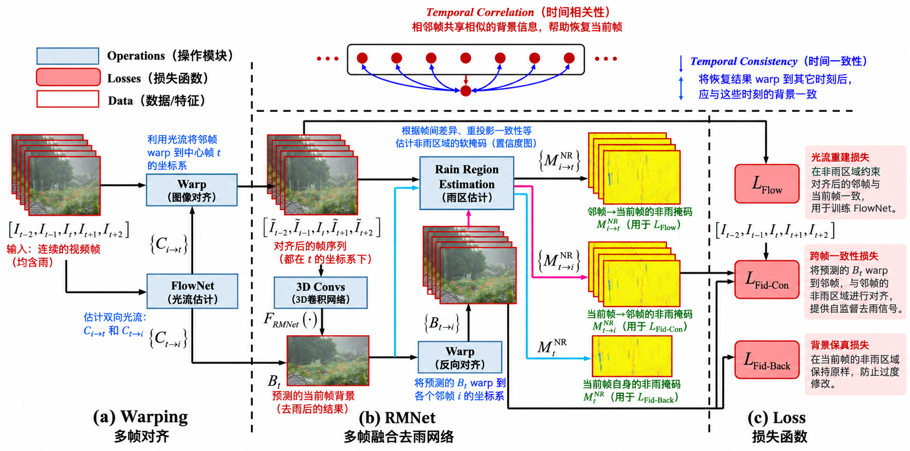

## Overview

一个不需要干净GT的视频去雨工作。先利用相邻帧恢复被雨条纹遮挡的背景，再去除雨滴积聚产生的雾状遮蔽（rain accumulation）。关键是利用视频自身提供监督：背景在对齐后应当一致，雨条纹则在时间上随机出现。

这里记录的是 SLDNet+ 扩展版：去雨条纹部分使用 RMNet，并加入蒸馏和视频去雨雾。

图中展示去雨条纹及其训练约束。下面先按前向流程介绍，再说明自监督和后续处理。

## Rain Model

只考虑雨条纹时，含雨帧可写为背景与雨条纹的叠加：

$$
I_t=J_t+R_t
$$

其中 $J_t$ 是干净背景，$R_t$ 是雨条纹。进一步考虑雨雾对光的衰减和散射：

$$
I_t=\alpha_t(J_t+R_t)+(1-\alpha_t)A
=\alpha_tJ_t+R'_t+(1-\alpha_t)A,
\qquad R'_t=\alpha_tR_t
$$

$\alpha_t$ 为逐像素透射率，$A$ 为视频中共用的大气光，$R'_t$ 是实际观测中的雨条纹分量。乘法按像素进行，透射率在RGB通道间共享。令去雨条纹后、仍含雨雾的图像为 $H_t$：

$$
I_t=H_t+R'_t,\qquad
H_t=\alpha_tJ_t+(1-\alpha_t)A
$$

因此整个恢复分为两步：RMNet 先从含雨视频估计 $H_t$，去除随机出现的 $R'_t$；Rain Accumulation Removal 再估计 $A$ 和 $\alpha_t$，从 $H_t$ 恢复 $J_t$。当 $\alpha_t=1$ 时，模型退化为只含雨条纹的加性模型。[论文 §3.1，式 (1)–(4)](http://39.96.165.147/Pub%20Files/2021/ywh_submission21.pdf#page=3)

下文为简洁起见，去雨条纹结果及其估计统一记作 $H_t$，对应框架图中的 $B_t$；$J_t$ 始终表示同时去除雨条纹与雨雾的背景。

## Assumption

1. 相邻帧共享背景，运动可以通过光流补偿。
2. 雨条纹在时间上随机出现，同一背景位置在其他帧中可能没有被雨遮挡。这里不要求雨在画面中空间均匀分布。
3. 可以根据帧间差异和恢复结果估计非雨区域，用其中较可靠的像素提供监督。

## 1. FlowNet & Warping

输入以 $I_t$ 为中心的一段含雨视频，例如 $[I_{t-2},I_{t-1},I_t,I_{t+1},I_{t+2}]$。FlowNet 估计邻帧与当前帧之间的双向光流，再将邻帧 warp 到当前帧坐标系：

$$
\tilde I_{i\to t}=\mathcal W(I_i,C_{i\to t})
$$

$\mathcal W$ 表示按光流重采样，当前帧本身不需要移动。对齐后，同一背景结构落在近似相同的位置，后面的网络才能有效融合多帧信息。

反方向的光流 $C_{t\to i}$ 留给训练使用：将预测背景送回邻帧坐标系，检查它能否解释其他时刻的观测。

## 2. RMNet

将对齐后的帧沿时间维度堆叠，输入 RMNet，预测当前帧去除雨条纹后的背景：

$$
H_t=F_{\mathrm{RMNet}}(\{\tilde I_{i\to t}\})
$$

主干由 3D 卷积、ReLU 和残差连接组成，同时提取空间纹理和帧间信息。中间特征主要为64通道，通过时间维度不补零的卷积逐步融合多帧，最后输出RGB图像。具体结构见[补充材料 Table 1](https://github.com/flyywh/CVPR-2020-Self-Rain-Removal-Journal/blob/main/pdf/TPAMI-Self-Video-Deraining-Sup-v2.pdf)。

这里的 temporal correlation 指利用邻帧中重复出现的背景，补充当前帧被雨遮挡的信息。网络直接预测 $H_t$，对应的雨条纹残差可写为 $\hat R'_t=I_t-H_t$；此时尚未分解透射率和大气光，结果仍可能有雨雾。

## 3. Rain Region Estimation

先将预测背景反向 warp 到各个邻帧：

$$
\tilde H_{t\to i}=\mathcal W(H_t,C_{t\to i})
$$

再根据含雨观测、对齐结果和预测背景之间的差异，估计非雨区域的软掩码 $M^{\mathrm{NR}}$。值越接近1，表示越适合用来监督；接近0的雨区则降低权重。它由图像关系和先验计算，不是一个需要雨区标注的分割网络。

三类掩码的计算为：

$$
M^{\mathrm{NR}}_{t\to i}
=\exp\left(
-\frac{\left[h_{\mathrm{ReLU}}(I_i-\tilde H_{t\to i})\right]^2}{\omega}
\right),\qquad i\ne t
$$

$$
M^{\mathrm{NR}}_{i\to t}
=\exp\left(
-\frac{\left[h_{\mathrm{ReLU}}(\tilde I_{i\to t}-I_t)\right]^2}{\omega}
\right),\qquad i\ne t
$$

$$
M^{\mathrm{NR}}_t
=\exp\left(
-\frac{\left[h_{\mathrm{ReLU}}(H_t-I_t)\right]^2}{\omega}
\right)
$$

其中 $h_{\mathrm{ReLU}}(x)=\max(x,0)$，只保留正差值，利用雨条纹通常使像素变亮这一先验。差值越大，指数衰减越强，对应位置越可能含雨；$\omega$ 控制衰减速度，相当于软阈值。论文实验取 $\omega=0.1$。

三个公式的方向下标表示比较所在的坐标系：

- $M^{\mathrm{NR}}_{i\to t}$：在当前帧坐标系中，筛选用于训练光流的区域。
- $M^{\mathrm{NR}}_{t\to i}$：在邻帧坐标系中，筛选用于监督预测背景的区域。
- $M^{\mathrm{NR}}_t$：保留当前帧自身的非雨区域，避免恢复时丢失细节。

运算均逐像素、逐通道进行，因此掩码与RGB图像形状相同。公式对应论文式 (14)、(15) 和 (17)。

## 4. Self-Supervised Loss

没有干净GT，因此用含雨帧中的非雨区域提供监督。令邻帧集合 $\mathcal N_t=\{t-s,\ldots,t+s\}\setminus\{t\}$，共有 $2s$ 帧，$\odot$ 表示逐元素相乘。总损失为：

$$
\mathcal L_{\mathrm{SSL}}
=\mathcal L_{\mathrm{Flow}}
+\lambda_T\mathcal L_{\mathrm{Fid-Con}}
+\lambda_B\mathcal L_{\mathrm{Fid-Back}}
$$

这里的 $\mathcal L_{\mathrm{SSL}}$ 对应论文的 $\mathcal L_{\mathrm{All}}$。三项分别约束光流对齐、跨帧一致性和当前帧细节保留。[论文 §4，式 (10)–(21)](http://39.96.165.147/Pub%20Files/2021/ywh_submission21.pdf#page=5)

### Flow Loss

$$
\mathcal L_{\mathrm{Flow}}
=\sum_{i\in\mathcal N_t}
\left\|M^{\mathrm{NR}}_{i\to t}\odot(\tilde I_{i\to t}-I_t)\right\|_2^2
$$

比较对齐后的邻帧与当前帧，在非雨区域约束背景一致，用来微调 FlowNet。这里使用平方 L2，掩码在平方之前乘到残差上。

### Temporal Consistency

$$
\mathcal L_{\mathrm{Fid-Con}}
=\frac{1}{2s}\sum_{i\in\mathcal N_t}
\ell_{\mathrm{fid}}^p\left(
M^{\mathrm{NR}}_{t\to i}\odot\tilde H_{t\to i},
M^{\mathrm{NR}}_{t\to i}\odot I_i
\right)
$$

将预测背景反向 warp 到邻帧，只比较邻帧中的非雨区域。同一份预测要能解释多个时刻的背景观测，抑制只在个别帧出现的雨条纹。

### Background Fidelity

$$
\mathcal L_{\mathrm{Fid-Back}}
=\ell_{\mathrm{fid}}^p\left(
M^{\mathrm{NR}}_t\odot H_t,
M^{\mathrm{NR}}_t\odot I_t
\right)
$$

保留当前帧自身的非雨区域，避免仅靠邻帧重建导致纹理模糊。它与跨帧一致性互补：当前帧可见的细节直接保留，被雨遮挡的部分从邻帧获得监督。

### Reweighted L1

上面两项 fidelity loss 使用重加权 L1。按原文式 (19)–(20) 的写法：

$$
\ell_{\mathrm{fid}}^p(x,y)=w\sum|x-y|,\qquad
w=\operatorname{stopgrad}\left(
\frac{1}{\sum|x-y|^{1-p}+\epsilon}
\right)
$$

$\epsilon$ 防止除零，$w$ 根据当前残差计算，但不参与反向传播。取 $p<1$ 鼓励稀疏残差，使含雨邻帧作为标签时更鲁棒，减少背景错位引起的细节损伤。

它是两项 fidelity loss 内部的度量，不是总损失中额外相加的一项；Flow loss 仍使用平方 L2。雨区掩码负责选择可信的监督区域，重加权则改变残差的惩罚方式。光流和 RMNet 联合优化，掩码随估计结果更新。

## 5. Distillation

随机选取一个邻帧 $k\in\mathcal N_t$，用对齐后的 $\tilde I_{k\to t}$ 替换输入中的当前帧 $I_t$。这样第 $k$ 帧出现两次，当前帧不再进入 RMNet，构造出更多雨条纹组合。

为避免网络直接复制重复帧，跨帧监督中排除 $k$：

$$
\mathcal L^d_{\mathrm{Fid-Con}}
=\frac{1}{2s}\sum_{i\in\mathcal N_t\setminus\{k\}}
\ell_{\mathrm{fid}}^p\left(
M^{\mathrm{NR}}_{t\to i}\odot\tilde H_{t\to i},
M^{\mathrm{NR}}_{t\to i}\odot I_i
\right)
$$

$$
\mathcal L^d_{\mathrm{SSL}}
=\mathcal L_{\mathrm{Flow}}
+\lambda_T\mathcal L^d_{\mathrm{Fid-Con}}
+\lambda_B\mathcal L_{\mathrm{Fid-Back}}
$$

其余两项不变；原来的 $I_t$ 仍可用于监督。这里的蒸馏是改变输入组合继续训练，改善细节保留和真实雨条纹适应能力。[论文 §4.6](http://39.96.165.147/Pub%20Files/2021/ywh_submission21.pdf#page=7)

## 6. Rain Accumulation Removal

去掉可见条纹后，密集雨滴的散射仍会降低对比度，因此再去除雨雾。这一步是基于视频颜色统计的非局部优化，不再训练 RMNet，也不加入上面的 SSL loss。[论文 §5，式 (23)–(29)](http://39.96.165.147/Pub%20Files/2021/ywh_submission21.pdf#page=7)

沿用前面的成像模型，RMNet 输出的 $H_t$ 仍包含雨雾：

$$
H_t=\alpha_tJ_t+(1-\alpha_t)A
$$

$A$ 是整个视频共用的大气光，$\alpha_t$ 是逐像素透射率。$\alpha_t$ 越小，颜色越接近 $A$，雨雾越重。

### Accumulation Line：按颜色方向聚类

先利用整个视频估计 $A$，将所有帧的RGB像素平移到以 $A$ 为原点的颜色空间：

$$
H_t^a=H_t-A=\alpha_t(J_t-A)
$$

将 $H_t^a$ 转为球坐标 $[r(u),\theta(u),\phi(u)]$。这里 $u$ 同时索引空间位置和帧号；$r$ 是颜色向量的长度，$\theta,\phi$ 表示方向，不是图像中的位置或角度。

随后只按角度 $(\theta,\phi)$ 将整个视频的像素聚类，每组形成一条 accumulation-line。它是RGB空间中从 $A$ 出发的一条射线，不是画面里的雨条纹，也不是语义分类。

依据是：透射率只缩放 $J_t-A$，不改变其方向。因此，干净颜色相同或接近、雨雾浓度不同的像素，会落在同一条线附近；不同帧、不同位置的像素都可以归入同一组。

### Initial Transmission：组内半径比

假设每条 accumulation-line 中至少有一个接近无雨雾的像素，即 $\alpha\approx1$。对组 $h$，用最远像素估计干净颜色到 $A$ 的距离：

$$
r_{\max,h}=\max_{v\in h}r(v),\qquad
\tilde\alpha(u)=\frac{r(u)}{r_{\max,h}},\quad u\in h
$$

例如，同组最大半径为0.5，某像素半径为0.2，则初始透射率为0.4。若组内所有像素都有明显雨雾，这个参考半径就会偏小，透射率容易被高估。

### Transmission Refinement：下界与保边平滑

先根据颜色非负约束，为透射率加入下界。以下 $I(u)$ 沿用原文式 (27)–(28) 的记号，表示这些约束中使用的观测颜色：

$$
\tilde\alpha_{\mathrm{LB}}(u)
=\max\left\{
\tilde\alpha(u),\,
1-\min_{c\in\{R,G,B\}}\frac{I_c(u)}{A_c}
\right\}
$$

该下界来自反解散射模型后RGB值应非负，避免透射率过低。再求解：

$$
\hat\alpha=\arg\min_a
\sum_u\frac{[a(u)-\tilde\alpha_{\mathrm{LB}}(u)]^2}{\sigma^2(u)}
+\lambda_r\sum_u\sum_{v\in\mathcal N_u}
\frac{[a(u)-a(v)]^2}{\|I(u)-I(v)\|_2^2}
$$

第一项保留初始估计，$\sigma(u)$ 是所在 accumulation-line 内 $\tilde\alpha_{\mathrm{LB}}$ 的标准差：组内变化越大，对初始值的约束越弱。

第二项做保边平滑。相邻像素颜色越接近，越倾向于具有相近透射率；颜色差异大时减弱平滑，保留物体边界。$\lambda_r$ 控制平滑强度。

原文将 $\mathcal N_u$ 定义为空间四邻域，式中没有显式的相邻帧差分项。时间一致性主要来自整个视频共享 $A$、accumulation-lines 和组内统计，避免逐帧独立估计造成闪烁。

### Reconstruction：反解散射模型

最后用优化后的透射率恢复每一帧：

$$
\hat J_t=\frac{H_t-(1-\hat\alpha_t)A}{\hat\alpha_t}
$$

先减去雨雾引入的大气光，再补偿背景的衰减。完整流程就是：全视频颜色方向聚类 → 组内最大半径估计透射率 → 下界约束与保边平滑 → 恢复图像。

## Cons

这个方法的监督依赖对齐和非雨区估计。大幅运动、遮挡或持续被雨覆盖的位置，会让可用的跨帧对应减少；错误的对应也可能被当作监督，造成细节模糊。自监督省去了干净GT，但仍依赖运动、雨条纹和颜色统计这些先验。
