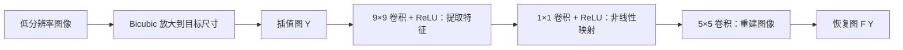

## Overview

SRCNN（*Image Super-Resolution Using Deep Convolutional Networks*，TPAMI 2016）用**三层卷积联合学习图像超分辨率**：将传统方法中的特征提取、非线性映射和图像重建统一为可训练网络。

核心是端到端优化整条恢复流程。它是 CNN 超分辨率的奠基工作，但不能泛称为“深度学习图像增强首篇”：原文也讨论了更早的神经网络去噪与恢复方法。

## Architecture

先用 bicubic 将低分辨率图像放大到目标尺寸，记为 $Y$；网络再将 $Y$ 映射为恢复图 $F(Y)$，目标为真实高分辨率图 $X$。

图中是经典 **9-1-5** 配置，隐藏层通道数为 64、32。网络内部没有上采样、池化或特征拼接；尺寸放大发生在网络之前。

### 1. Patch Extraction and Representation

$$
F_1(Y)=\max(0,W_1*Y+B_1)
$$

第一层用 $9\times9$ 卷积提取重叠邻域特征，每个位置生成 64 维表示。滑动卷积已经完成“逐块提取”，无需显式裁块再分别运行网络。

### 2. Non-linear Mapping

$$
F_2(Y)=\max(0,W_2*F_1(Y)+B_2)
$$

经典配置使用 $1\times1$ 卷积，将每个位置的 64 维表示映射为 32 维高分辨率图块表示。虽然卷积核是 $1\times1$，输入特征已包含第一层提取的 $9\times9$ 邻域信息。

TPAMI 版本还研究了 $3\times3$、$5\times5$ 映射核，即 9-3-5、9-5-5，以进一步融合相邻位置的信息。

### 3. Reconstruction

$$
F(Y)=W_3*F_2(Y)+B_3
$$

最后一层用 $5\times5$ 卷积融合相邻位置的表示，输出图像像素，不加 ReLU。它学习如何重建并聚合重叠区域；无需另外拼接图块或固定平均。

### 尺寸图例

经典单通道配置在训练时不加 padding。若插值后的输入为 $33\times33$：

$$
33\times33\times1
\xrightarrow{9\times9}25\times25\times64
\xrightarrow{1\times1}25\times25\times32
\xrightarrow{5\times5}21\times21\times1
$$

因此只与 GT 中央的 $21\times21$ 区域计算损失。经典实验主要恢复 YCbCr 的 Y 通道，色度通道用插值；期刊版也研究了三通道联合恢复。

## 与稀疏表示的关系

| 传统稀疏表示 SR | SRCNN 中的对应操作 |
| --- | --- |
| 提取图块、投影到低分辨率字典 | 第一层卷积学习特征 |
| 迭代求解稀疏系数 | 前两层共同完成前馈编码与非线性映射 |
| 高分辨率字典重建、合并重叠图块 | 最后一层卷积统一完成重建与聚合 |

这是结构上的对应：SRCNN 没有显式稀疏约束，也不在推理时求解稀疏优化问题。所有卷积参数由最终图像误差共同更新。

## Training

按原文 Eq. 4，使用 MSE：

$$
L(\Theta)=\frac{1}{n}\sum_{i=1}^{n}
\|F(Y_i;\Theta)-X_i\|^2
$$

1. 从 HR 图像构造退化样本：模糊、下采样，再 bicubic 放大，得到 $Y_i$。
2. 经过三层卷积生成预测，与对齐的 GT 区域计算 MSE。
3. 通过反向传播联合更新三层参数。

推理只需 bicubic 放大和一次网络前向传播，不需要 GT。

## Discussion

**贡献**：证明简单的全卷积网络可以联合学习 SR 流程，替代分步骤设计与迭代求解。

**效果**：论文 Table II 的 Set5、3 倍超分辨率中，Bicubic 为 30.39 dB，A+ 为 32.59 dB，SRCNN 为 32.75 dB。该结果对应期刊版实验，不能直接当作经典 9-1-5 配置的成绩。

**局限**：预先放大会增加后续卷积计算量；像素 MSE 有利于 PSNR，但难以恢复不确定的高频纹理。[[SRGAN]] 随后着重讨论了像素准确性与感知质量的区别。

来源：[原文（§III、§IV、Table II）](https://arxiv.org/abs/1501.00092)
