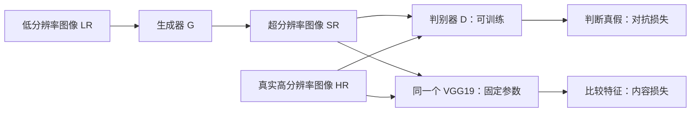
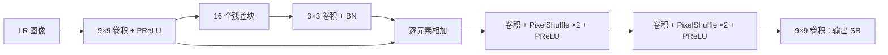

## Overview

SRGAN（*Photo-Realistic Single Image Super-Resolution Using a Generative Adversarial Network*，CVPR 2017）将**残差超分辨率网络、VGG 内容损失和对抗训练**结合，重点改善 4 倍超分辨率的纹理真实感。

只优化像素 MSE 时，多种合理纹理容易被平均成平滑结果。SRGAN 用内容损失约束图像内容，用判别器推动输出接近自然图像分布；视觉质量提高不代表 PSNR 更高。

## Architecture

训练涉及三个网络，推理只保留生成器 $G$：

### Generator：SRResNet

生成器直接接收 $H\times W\times3$ 的 LR 图像，在低分辨率空间提取特征，再在末端放大：

每个残差块为：

$$
F_{\mathrm{out}}=F+
\operatorname{BN}_2\!\left(W_2*
\operatorname{PReLU}\!\left(\operatorname{BN}_1(W_1*F)\right)\right)
$$

两个卷积均为 $3\times3$、64 通道。块内短跳连和主干长跳连都做**逐元素相加**，不做通道拼接。

**放大位置**：每个上采样模块先用卷积将 64 通道扩展到 256，再用 PixelShuffle 将通道重排到空间：

$$
H\times W\times64
\xrightarrow{\mathrm{Conv}}H\times W\times256
\xrightarrow{\mathrm{PixelShuffle}(2)}2H\times2W\times64
$$

重复一次得到 $4H\times4W\times64$，最后映射为三通道图像。与 [[SRCNN]] 先插值放大不同，SRGAN 在主干之后学习上采样。

### Discriminator

判别器接收真实 HR 或生成的 SR，输出“真实图像”的概率。它由八层卷积、LeakyReLU、两层全连接和 sigmoid 组成，通过步长卷积降低分辨率，通道逐步从 64 增至 512。

判别器不接收 LR 配对图，因此负责判断输出是否像自然图像；与输入内容的对应由内容损失约束。

## Loss

### Content Loss：内容一致

原文先定义像素 MSE，作为 SRResNet 的训练目标：

$$
l_{\mathrm{MSE}}^{SR}=\frac{1}{r^2WH}
\sum_{x=1}^{rW}\sum_{y=1}^{rH}
\left(I_{x,y}^{HR}-G_{\theta_G}(I^{LR})_{x,y}\right)^2
$$

SRGAN 的主要版本改用预训练 VGG19 的特征误差（原文 Eq. 5）：

$$
l_{\mathrm{VGG}/i.j}^{SR}=
\frac{1}{W_{i,j}H_{i,j}}
\sum_{x=1}^{W_{i,j}}\sum_{y=1}^{H_{i,j}}
\left(\phi_{i,j}(I^{HR})_{x,y}
-\phi_{i,j}(G_{\theta_G}(I^{LR}))_{x,y}\right)^2
$$

$\phi_{i,j}$ 为 VGG19 第 $i$ 次池化之前、第 $j$ 个卷积经过激活后的特征；$W_{i,j},H_{i,j}$ 为其空间尺寸。论文最终的 SRGAN 使用 $\phi_{5,4}$。

VGG 参数固定，但梯度通过 VGG 传回生成器。比较特征能约束内容，同时允许一定的像素级差异。

### Adversarial Loss：纹理真实

生成器使用原文 Eq. 6 的目标：

$$
l_{\mathrm{Gen}}^{SR}=\sum_{n=1}^{N}
-\log D_{\theta_D}\!\left(G_{\theta_G}(I_n^{LR})\right)
$$

它推动判别器将生成图判为真实。这里用 $-\log D(G(\cdot))$ 更新生成器，以获得更好的梯度。

判别器则最大化：

$$
\mathbb E_{I^{HR}}[\log D_{\theta_D}(I^{HR})]
+\mathbb E_{I^{LR}}[\log(1-D_{\theta_D}(G_{\theta_G}(I^{LR})))]
$$

### Total Loss

沿用原文 Eq. 3：

$$
l^{SR}=l_{\mathrm X}^{SR}+10^{-3}l_{\mathrm{Gen}}^{SR}
$$

$l_{\mathrm X}^{SR}$ 表示所选内容损失；最终 SRGAN 用 $l_{\mathrm{VGG}/5.4}^{SR}$。原文将这一组合称为 **perceptual loss**，其中包含 VGG 内容损失和对抗损失。

## Training & Inference

1. **预训练**：用 HR 的 bicubic 下采样图构成 LR–HR 配对，以 MSE 训练生成器，得到 SRResNet。
2. **更新判别器**：固定生成器，用真实 HR 和生成 SR 学习区分真假。
3. **更新生成器**：固定判别器参数，最小化 VGG 内容损失与对抗损失的加权和；重复交替更新。
4. **推理**：只运行生成器，一次前向传播得到 SR，VGG 和判别器均不参与。

“固定判别器”是指不更新其参数，生成器仍需通过它接收梯度。论文实验采用 4 倍放大，即 $24\times24$ LR 裁块对应 $96\times96$ HR 裁块。

## Discussion

**核心贡献**：将优化目标从单纯像素误差转向内容一致与纹理真实的结合。GAN 和 VGG 特征损失都有前作，原文也提到更早的 GAN 人脸超分辨率，因此“首次将 GAN 用于任何 SR”过于绝对。

**效果取舍**：论文 Table 2 的 BSD100、4 倍超分辨率结果如下。MOS 是人工质量评分，范围 1–5。

| 方法 | PSNR ↑ | SSIM ↑ | MOS ↑ |
| --- | ---: | ---: | ---: |
| SRResNet-MSE | 27.58 | 0.7620 | 2.29 |
| SRGAN-VGG54 | 25.16 | 0.6688 | 3.56 |
| 真实 HR | — | 1 | 4.46 |

SRGAN 的像素指标下降，人工观感评分提高。它生成的是与输入相容、看起来合理的细节，不能保证这些纹理就是原场景中丢失的真实细节。

来源：[原文（§2、§3、Table 2）](https://arxiv.org/abs/1609.04802)
