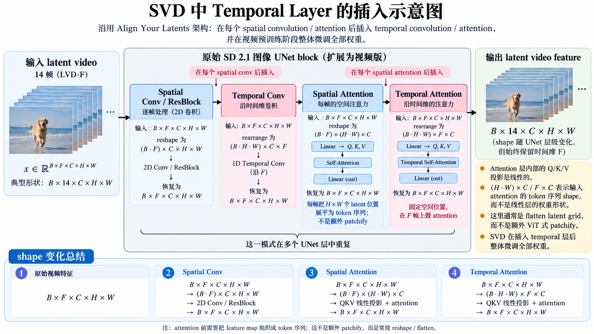

## Overview
一篇聚焦 data pipeline 和训练策略的工作。在架构和算法上没有突出的改变，但依然超越了前代模型成为SOTA。

## Data Curation and Processing

镜头切分流水线（Cuts Detection Pipeline）

每个 clip 用 3 种合成 caption 方法标注：
- 图像 caption 模型（image captioner，如 CoCa）标注中间帧（mid frame）
- V-BLIP 生成视频级（video-based）caption
- LLM 总结（summarize）以上两者

得到 LVD

接下来清洗掉低运动量（less motion）、文字过多（excessive text presence）、低美学价值（low aesthetic value）的 clips。

<!--aesthetic value and LAION-5b 的相关内容，或许加入concepts，LAION-5b是常用数据集，集成在concepts/Datasets.md 中，并在index.md中加入LAION-5b作为待读论文-->

## 3 Different Training Regime for Generative Video Modeling

### Stage 1: Image Pretraining
i.e. 直接使用SD 2.1这种预训练图像模型

### Stage 2: Curating a Video Pretraining Datasets

**A systematic approach to video data curation**

通过一系列复杂的方法获得每个指标最优的清洗阈值，如果是可量化的指标，则直接排序；难以量化的指标采用Elo ranking的方法。

**Curated training data improves performance**

根据人的感受洗出来的，当然表现更好

**Data Curation Helps at Scale**

显而易见

### Stage 3: HQ Finetuning

> Here, we draw on training techniques from latent image diffusion modeling [13, 64] and increase the resolution of the training examples.

使用了 latent image diffusion 的微调技巧（Emu、SDXL，即论文引 [64, 13]）：
- **小规模高质量微调**：只用 250K 高视觉保真、预标注（pre-captioned）的 clips 做 finetune；
- **提升训练样本的分辨率**。

> We initialize the weights of the first with a pretrained image model and skip video pretraining, a common choice among many recent video modeling approaches [9, 82]. ... We finetune all models for 50K steps ... We show the obtained results in Figure 4e, where we plot the Elo improvements of user preference relative to the model ranked last, which is the one initialized from an image model. Moreover, the finetuning resumed from curated pretrained weights ranks consistently higher than the one initialized from video weights after uncurated training. ... Given these results, we conclude that ... video pretraining should ideally occur on a large scale, curated dataset, since performance differences after pretraining persist after finetuning.

这里很有意思，这里说明微调不能完全取代预训练

## 下游任务上的优良表现

### 训练一个强而有力的基座模型

1. **$512\times512$ 图像适配**：从 SD 2.1 开始，把原来的离散 noise schedule 改成 EDM 的连续噪声训练，先训约 1k steps，主要适配新的 noise/time embedding。
2. **$256\times384$ 图像训练**：仍然是图像模型，不加 temporal layer，继续训约 30k steps，让整个 UNet 适应 EDM continuous noise 和新的分辨率。
3. **$14\times256\times384$ 视频预训练**：此时才插入 temporal convolution / temporal attention，在 LVD-F 上训练 150k steps，batch size 1536。
4. **$14\times320\times576$ 视频预训练**：从上一步继续训练 100k steps，batch size 768，同时把 noise distribution 往更大噪声方向 shift。

这里现在低分辨率下训练，再在高分辨率下训练，节省计算效率，又复合coarse-to-fine的范式

1. High-resolution Text-to-Video Model
2. High Resolution Image-to-Video Model
3. Camera Motion LoRA
4. Frame Interpolation
5. Multiview Generation：可以生成多个角度的照片，__真可谓世界模型__

## Related

*与世界模型

* **temporal layer 的使用**：沿用 Align your Latents（Blattmann et al. [9]，同组工作）的架构——在 SD 2.1 的每个 spatial convolution / attention 层之后插入 temporal convolution 与 temporal attention，为图像 UNet 补上跨帧（时间维）建模；与只训练 temporal 层的做法不同，SVD 插入后**整体微调全部权重**。插入发生在视频预训练阶段（LVD-F，14 帧，见上文基座训练步骤），这套用法本质上不是这篇文章的贡献。

一篇代表大数据风范的工作
