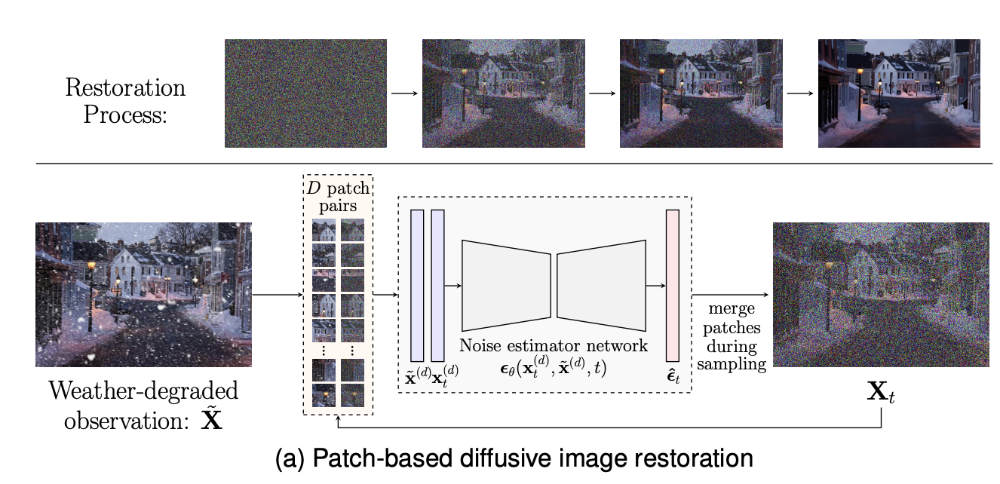
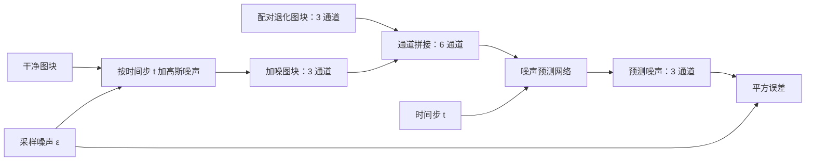
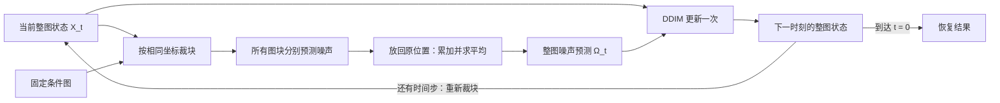

## Overview



WeatherDiff（arXiv 2022，TPAMI 2023）用**条件扩散模型恢复恶劣天气图像**。核心是：训练时学习小图块的恢复，推理时在**每个去噪步融合重叠图块的噪声预测，再统一更新整图**，从而处理不同尺寸的图像并减少拼接边界。

论文全名：*Restoring Vision in Adverse Weather Conditions with Patch-Based Denoising Diffusion Models*。

## Conditional Diffusion

记 $X_0$ 为干净整图，$\tilde X$ 为天气退化整图；小写 $x_0^{(i)},\tilde x^{(i)}$ 表示从相同位置裁出的 $p\times p$ 图块。

训练时只对**干净图块**加高斯噪声，天气退化图块始终作为条件：

$$
x_t^{(i)}=\sqrt{\bar\alpha_t}\,x_0^{(i)}+\sqrt{1-\bar\alpha_t}\,\epsilon_t,
\qquad \epsilon_t\sim\mathcal N(0,I)
$$

其中 $\alpha_t=1-\beta_t$，$\bar\alpha_t=\prod_{j=1}^{t}\alpha_j$。网络学习预测人为加入的高斯噪声 $\epsilon_t$，天气退化通过条件恢复过程去除。

### Noise Estimator

噪声预测器 $\epsilon_\theta(x_t,\tilde x,t)$ 使用带残差块的 U-Net，结合 GroupNorm、$16\times16$ 特征分辨率上的 self-attention，以及注入各残差块的时间嵌入。

**输入拼接发生在通道维度**：

$$
\underbrace{\operatorname{Concat}_C(x_t^{(i)},\tilde x^{(i)})}_{p\times p\times6}
\xrightarrow{\epsilon_\theta(\cdot,t)}
\underbrace{\hat\epsilon_t^{(i)}}_{p\times p\times3}
$$

两个 RGB 图块空间位置对应，拼接不改变分辨率。同一网络在所有图块和时间步共享参数。

## Training：学习预测图块噪声

每次训练迭代执行四步：

1. 从干净图 $X_0$ 和退化图 $\tilde X$ 的**相同位置**随机裁出一对图块。
2. 随机采样时间步 $t$ 和高斯噪声 $\epsilon_t$，按前向公式得到加噪图块 $x_t^{(i)}$。
3. 将 $x_t^{(i)}$ 与退化图块 $\tilde x^{(i)}$ 沿通道拼接，连同 $t$ 输入网络，预测噪声。
4. 用预测噪声与实际加入的 $\epsilon_t$ 计算误差，更新网络参数。



原文 Algorithm 1 的优化目标为：

$$
\left\|\epsilon_t-\epsilon_\theta\!\left(
\sqrt{\bar\alpha_t}\,x_0^{(i)}+\sqrt{1-\bar\alpha_t}\,\epsilon_t,
\tilde x^{(i)},t
\right)\right\|^2
$$

监督目标是**人为加入的高斯噪声**。每次训练只预测一个随机时间步，重叠融合在推理时执行。

WeatherDiff 在 AllWeather 多天气配对数据上联合训练，不输入天气类别标签。论文另有分别训练的 SnowDiff、RainHazeDiff、RainDropDiff；下标 64 / 128 表示图块边长。

## Sampling：逐步恢复整图

输入只有退化图 $\tilde X$。先生成一张同尺寸的高斯噪声图作为初始状态，再沿递减时间步序列迭代。**整个过程维护一张共享的整图状态 $X_t$，条件图 $\tilde X$ 始终不变。**



### 1. 从共享状态裁取重叠图块

选择图块边长 $p$、滑动步长 $r<p$，记录覆盖整图的 $D$ 个图块位置。在每个位置，从 $X_t$ 和 $\tilde X$ 裁出对应图块：

$$
x_t^{(d)}=\operatorname{Crop}(P_d\circ X_t),\qquad
\tilde x^{(d)}=\operatorname{Crop}(P_d\circ\tilde X)
$$

$P_d$ 是位置掩码，$\circ$ 为逐元素乘法。每对图块拼成六通道输入，得到该区域的三通道噪声预测 $\epsilon_\theta(x_t^{(d)},\tilde x^{(d)},t)$。

同一像素在不同图块中的当前值相同，但因周围上下文不同，预测出的噪声可能不同。

### 2. 对重叠位置的噪声预测求平均

每个时间步都将累加图 $\hat\Omega_t$ 和计数图 $M$ 清零，再遍历所有图块。沿用原文 Algorithm 2 的写法：

$$
\hat\Omega_t\leftarrow\hat\Omega_t+
P_d\cdot\epsilon_\theta(x_t^{(d)},\tilde x^{(d)},t),
\qquad M\leftarrow M+P_d
$$

全部累加完后：

$$
\hat\Omega_t\leftarrow\hat\Omega_t\oslash M
$$

这里 $P_d\cdot\epsilon_\theta$ 表示将图块预测**放回整图对应位置**，$\oslash$ 为逐元素除法。每个像素分别对覆盖它的预测求均值。

#### 图例：四个图块如何共享一个区域？

下面用 $3\times3$ 网格表示整图，每格大小为 $r\times r$，取 $p=2r$。A、B、C、D 分别覆盖左上、右上、左下、右下的 $2\times2$ 网格：

| | 左 | 中 | 右 |
| --- | --- | --- | --- |
| 上 | A | A、B | B |
| 中 | A、C | **A、B、C、D** | B、D |
| 下 | C | C、D | D |

中央区域的每个像素收到四个预测。例如某像素某通道的预测为：

$$
\hat\epsilon_A=0.2,\quad\hat\epsilon_B=0.4,\quad
\hat\epsilon_C=0.1,\quad\hat\epsilon_D=0.5
$$

则该位置累加值为 $1.2$，计数为 $4$，整图噪声预测为 $1.2/4=0.3$。角落只被一个图块覆盖，直接使用该图块的预测。

**融合的是同一位置的噪声估计，不是把相邻像素模糊，也不是拼接网络中间特征。**

### 3. 用融合噪声统一更新整图

原文的 DDIM 更新可拆成两步理解。先估计干净图像：

$$
\hat X_0^{(t)}=
\frac{X_t-\sqrt{1-\bar\alpha_t}\,\hat\Omega_t}
{\sqrt{\bar\alpha_t}}
$$

再构造噪声更少的下一时刻状态：

$$
X_{t_{\mathrm{next}}}=
\sqrt{\bar\alpha_{t_{\mathrm{next}}}}\,\hat X_0^{(t)}
+\sqrt{1-\bar\alpha_{t_{\mathrm{next}}}}\,\hat\Omega_t
$$

$t_{\mathrm{next}}<t$。两式合并即原文 Algorithm 2 的更新式；最后取 $t_{\mathrm{next}}=0$、$\bar\alpha_0=1$，直接得到恢复图。初始噪声确定后，后续不再额外加入随机噪声。

**所有图块预测完成后，整图才更新一次。** 下一步重新从更新后的整图裁块，因此重叠区域使用同一个更新值，邻近图块在每一步都能协调。

### 完整推理算法

```text
输入：退化图、图块位置列表、递减采样时间步列表
初始化：生成与退化图同尺寸的高斯噪声图 X

对每一对时间步 t → t_next：
    创建全零的噪声累加图 Ω 和覆盖计数图 M
    对每个图块位置：
        从 X 和退化图的同一位置裁块
        沿通道拼接，用网络预测该块噪声
        将预测累加到 Ω 的对应区域，该区域的 M 加 1
    Ω = Ω / M
    用 X、Ω、t、t_next 执行一次整图 DDIM 更新

返回：最后的整图 X
```

WeatherDiff$_{64}$ 的主要结果使用 25 个采样步，$p=64$、$r=16$。更小的 $r$ 会增加重叠与计算量。论文实验先将宽高调整为 16 的倍数，裁块需覆盖全部像素，保证 $M>0$。

## Discussion

**核心贡献**是采样过程中的跨图块协调：每步先融合噪声，再更新共享整图。独立恢复各块后才平均最终图像，无法在去噪过程中协调邻域。U-Net、噪声预测损失和 DDIM 都沿用已有设计。

**指标提升**：以下为论文 Fig. 3 的多天气模型对比，PSNR 按 Y 通道计算。

| 测试集 | TransWeather | WeatherDiff$_{64}$ | 提升 |
| --- | ---: | ---: | ---: |
| Snow100K-S | 32.51 | 35.83 | +3.32 dB |
| Snow100K-L | 29.31 | 30.09 | +0.78 dB |
| Outdoor-Rain | 28.83 | 29.64 | +0.81 dB |
| RainDrop | 30.17 | 30.71 | +0.54 dB |

并非所有指标都领先：RainDrop 上 All-in-One 的 PSNR 为 31.12 dB，高于 WeatherDiff$_{64}$；后者 SSIM 更高。

**主要代价是速度**：论文中 $640\times432$ 图像、10 步采样、单张 A40 的耗时为 20.52 秒，TransWeather 为 0.88 秒。多天气训练也不保证能处理未见过的退化。

与 [[MPRNet]] 的阶段特征交互相比，WeatherDiff 的交互发生在**每次采样的重叠噪声预测**上；与 [[DiffIR]] 的紧凑先验扩散相比，这里直接在像素空间迭代生成恢复图。

来源：[原文（§III、Algorithms 1–2、Fig. 3、§V-A）](https://arxiv.org/pdf/2207.14626) · [官方代码](https://github.com/IGITUGraz/WeatherDiffusion)
