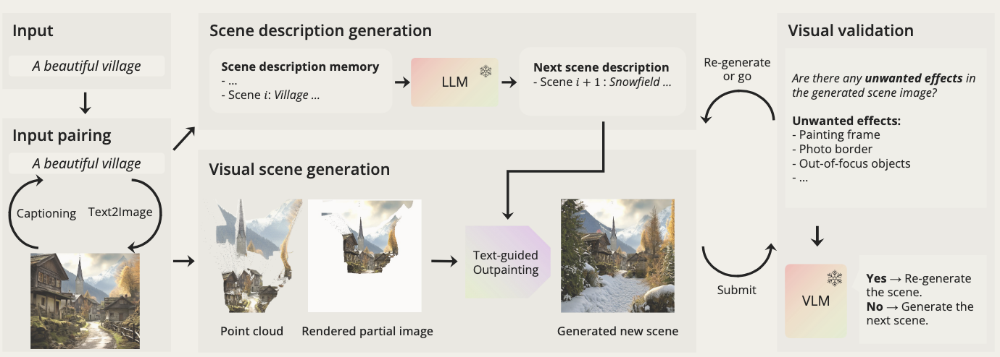
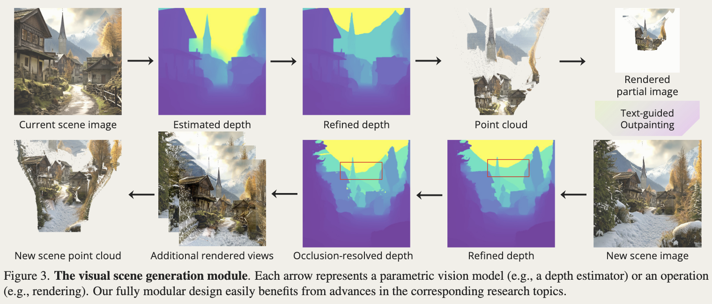

## Overview

~~我觉得这只是一个编排好的工作流~~

## Scene-description Generation

使用一个 LLM 负责场景描述的逐步生成。

维护 scene description memory：

$$
\mathcal M_i=\{\mathcal S_0,\mathcal S_1,\cdots,\mathcal S_i\},
$$

LLM 接收 task specification 和 memory $\mathcal M_i$，生成下一场景：

$$
\mathcal S_{i+1}=\{S,O_{i+1},B_{i+1}\},
$$

其中：

* $S$：整个 journey 保持一致的 style；
* $O_i$：场景中的主要 objects；
* $B_i$：简短的 background description。

每生成一个场景，就将其加入 memory。

作者没有直接要求 LLM 输出最终的 structured description，而是先生成自然语言，再通过 lexical category filter 对 $O_i,B_i$ 做处理，只保留表示 entity 的 nouns 和表示 attribute 的 adjectives。

作者声称这样比直接要求 LLM 输出结构化描述更加 coherent，不过没有看到对应的定量验证，基本属于 empirical heuristic。

因此这里的 scene planning 本质上只是：

$$
\text{previous descriptions}
\rightarrow
\text{LLM}
\rightarrow
\text{next description},
$$

并没有显式建模 3D state，也不负责规划 camera trajectory。

## Visual Scene Generation

给定当前场景图像 $I_i$ 和下一场景描述 $\mathcal S_{i+1}$，生成下一场景的点云：

$$
P_{i+1}=g_{\text{visual}}(I_i,\mathcal S_{i+1}).
$$

整个模块基本由 pretrained models、几何操作和若干 heuristic 组成。

### 1. Lift current scene to 3D

首先使用单目深度模型估计 $I_i$ 的 depth，并反投影成点云 $P_i$。

由于 monocular depth 在物体边界、天空和远景区域不可靠，作者又加入了一套 depth refinement：

* 使用 SAM segmentation，对 disparity range 较小的 segment 直接将 depth flatten 成中位数；
* sky 被人为放到远处；
* 过远区域统一放到一个 far background plane。

### 2. Render + Outpainting

将 camera 从 $C_i$ 移动到新视角 $C_{i+1}$，从已有点云 $P_i$ 渲染得到 partial image：

$$
\hat I_{i+1}.
$$

然后根据场景描述做 text-guided outpainting：

$$
I_{i+1}
=
g_{\text{outpaint}}
(\hat I_{i+1},\mathcal S_{i+1}).
$$

camera trajectory 是人为指定的，而不是由 LLM 规划。

作者还会刻意选择能够产生足够大 empty space 的新视角，因为 outpainting model 往往不愿意在图像边缘生成 truncated objects。空白区域太小时，模型更容易只是延拓已有图像，而不会真正加入新的 objects。

### 3. Lift new scene to 3D

对新生成的 $I_{i+1}$ 再做一次 monocular depth estimation，将 outpaint 新增区域反投影得到

$$
P'_{i+1},
$$

并形成

$$
\hat P_{i+1}=P_i\cup P'_{i+1}.
$$

但因为这是一次独立的单目深度估计，所以 $P'_{i+1}$ 通常不会天然和旧点云 $P_i$ 对齐。

### 4. Depth alignment

作者使用已有点云能够解析计算出的 depth 作为几何约束：

$$
\mathcal L_{\text{depth}}
=
\max(0,D^*_{bg}-D'_{bg})
+
\|D^*_{fg}-D'_{fg}\|.
$$

对于具有较可信几何的区域，直接要求新旧 depth 对齐；对于 far background，则只施加单边约束。

### 5. Occlusion handling

新生成区域还可能出现错误的遮挡关系，例如 disocclusion region 被估计到 occluder 前面。

因此作者将新点云重新投影回旧相机 $C_i$，检查与原点云冲突的新增点，并直接将这些点向后移动，保证：

$$
\text{disocclusion lies behind occluder}.
$$

### 6. Scene Completion

最后沿着 $C_i\rightarrow C_{i+1}$ 的 camera trajectory 插入若干中间相机，不断重复：

$$
\text{render}
\rightarrow
\text{outpaint}
\rightarrow
\text{depth}
\rightarrow
\text{unproject}
\rightarrow
\text{add points}.
$$

作者称其为 **complete-as-you-go**，主要用于补全中间视角逐渐暴露出的区域。

理论上可以始终维护完整点云作为 persistent scene representation，但长轨迹下点数和显存消耗会迅速增加，因此实验中实际采用的是 image formulation。

## Visual Validation

使用预训练 VLM 检查生成图中是否出现预定义的不良现象，例如：

* photo border；
* painting frame；
* out-of-focus objects。

若检测到，则更换 scene description 或 random seed，重新生成该场景。

## Exp.

数据来源包括作者自己拍摄的照片、网络上的 copyright-free images 和 generated examples，并不存在一个标准 perpetual 3D scene generation benchmark。

实验也缺乏充分合理的 baseline 和针对核心 claim 的定量分析，主要依赖 human preference。

一个强调 consistency、并在 visual generation 中加入大量步骤保证 consistency 的工作，最终却没有一个直接衡量长期 3D / multi-view consistency 的指标。

同时 baseline 本身存在明显 task/domain mismatch，各方法甚至使用各自的 camera trajectory，因此 human preference 很难说明提升究竟来自 3D consistency、内容丰富度还是 camera path。

## 碎碎念

几个问题：
1. 单目重建点云并不准确
2. 只支持 outpainting，对于 zoom-in 的镜头轨迹并不支持
3. LLM 的幻觉会影响 consistency

这个工作的唯一价值可能在炒作了 perpetual scene generation 这个概念吧。

整体上基本可以概括成：

$$
\text{LLM}
+
\text{SD Outpainting}
+
\text{Monocular Depth}
+
\text{Segmentation}
+
\text{Point Cloud Rendering}
+
\text{Consistency Heuristics}.
$$

主要贡献更像 task formulation + system integration，而不是新的生成模型或 3D representation。

可以预见 Atlas 更接近真正解决这个问题：不是依靠逐张图生成后再做单目深度、对齐和遮挡修补，而是在统一 spatial context 中直接建模 observation、camera pose 与 3D structure。

至于多风格生成，我猜本身没有太大障碍；普通风格可能已经由 foundation model 覆盖，特定风格则可以考虑对图像生成部分使用 LoRA / adapter。
